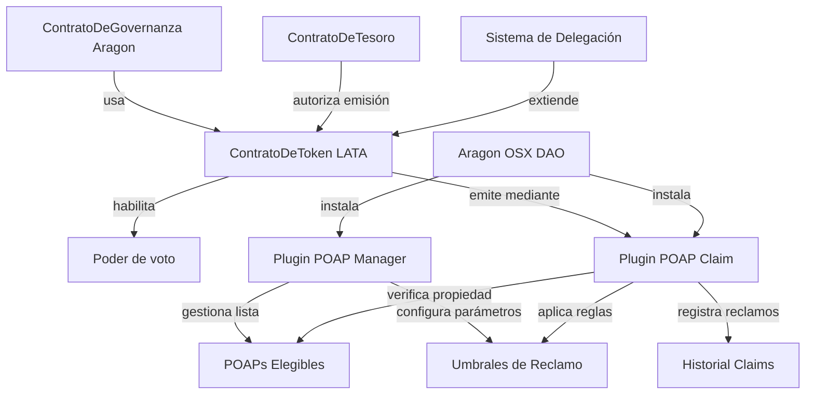
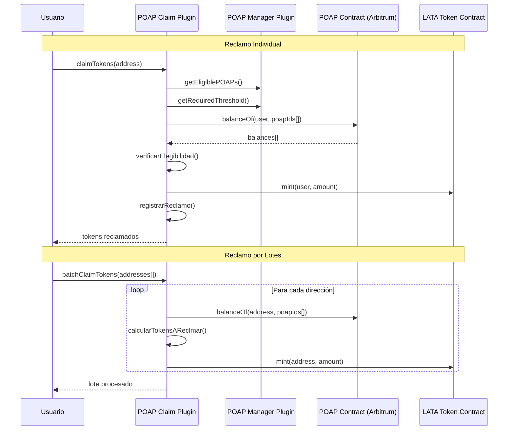
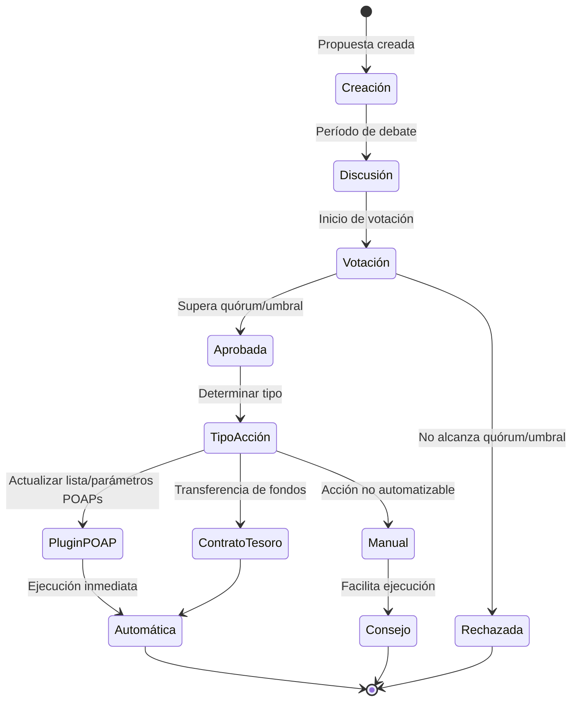
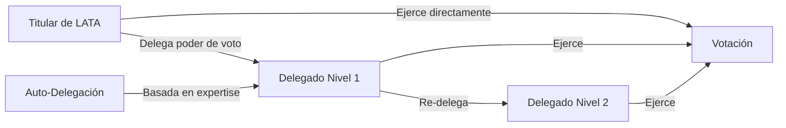
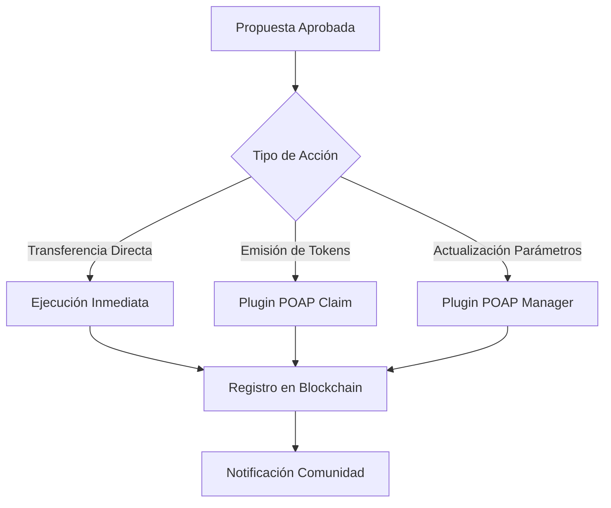

# EnceboDAO: Yellow Paper v2.0

## Resumen

Este documento detalla la arquitectura técnica, económica y de gobernanza de la DAO de la comunidad de EthEcuador, una organización autónoma descentralizada diseñada para fomentar el crecimiento del ecosistema web3 en Ecuador. A través de mecanismos de incentivos tokenizados automatizados, sistemas de votación descentralizados y gestión transparente del tesoro, EthEcuador DAO establece un marco para la participación comunitaria, la toma de decisiones colectivas y el desarrollo de proyectos con impacto local.

## 1. Introducción

EnceboDAO (Derivado de "Encebollado", la sopa más famosa de Ecuador) es una organización, con el toque ecuatoriano, representada por reglas codificadas en contratos inteligentes, caracterizada por su transparencia, resistencia a la censura y gobernanza descentralizada. La DAO busca aumentar el compromiso y sentido de pertenencia de los miembros de la comunidad mediante el uso de plataformas web3, promoviendo la transparencia, descentralización e inclusión en todos sus procesos.

## 2. Principios Fundamentales

La arquitectura de EnceboDAO se basa en los siguientes principios:

1. **Descentralización**: La toma de decisiones debe distribuirse entre los miembros de la comunidad.
2. **Transparencia**: Todas las operaciones, transacciones y decisiones deben ser verificables en la blockchain.
3. **Meritocracia**: Las contribuciones a la comunidad son reconocidas y recompensadas proporcionalmente.
4. **Sostenibilidad**: La estructura económica debe garantizar la viabilidad a largo plazo de la organización.
5. **Inclusividad**: Barreras mínimas de entrada para nuevos miembros de la comunidad.
6. **Automatización**: Los procesos de distribución de tokens y gestión de incentivos están automatizados y son verificables.

## 3. Arquitectura Técnica

### 3.1 Red de Despliegue

El despliegue será en **Arbitrum**, una solución capa 2 para Ethereum, seleccionada por sus ventajas:

- Bajos costos de transacción en comparación con Ethereum mainnet.
- Alta seguridad heredada de Ethereum.
- Ecosistema establecido de herramientas para DAOs.
- Compatibilidad completa con estándares ERC-20 y ERC-721.
- Tiempos de confirmación rápidos.
- Soporte nativo para POAPs en la red Arbitrum.

### 3.2 Plataforma de Gestión

La DAO utiliza **Aragon OSX** como plataforma principal para su creación y administración, aprovechando sus características:

- Arquitectura modular con plugins personalizados
- Interfaz intuitiva para creación y gestión de DAOs
- Módulos preconfigurados para votación, finanzas y membresías
- Amplia compatibilidad con Arbitrum
- Herramientas de gestión de tesoro integradas
- Sistema de plugins extensible para funcionalidades específicas

### 3.3 Componentes del Sistema

#### 3.3.1 Contratos Inteligentes Principales

1. **ContratoDeToken (LATA)**: Implementación ERC-20Votes del token de gobernanza.
   - Funciones de emisión controlada por el Plugin POAP Claim.
   - Mecanismos de distribución automatizada basados en verificación de POAPs.
   - Sistema de delegación de votos integrado (ERC-20Votes).
   - Interfaz para consulta de balances y derechos de voto.

2. **Plugin POAP Manager**: Plugin de Aragon OSX para gestión de parámetros.
   - Gestión de lista de POAPs elegibles (actualizable por gobernanza).
   - Configuración de umbrales de reclamo (inicialmente 5 POAPs).
   - Control de acceso basado en permisos de Aragon.
   - Interfaz para administración de parámetros.

3. **Plugin POAP Claim**: Plugin de Aragon OSX para automatización de reclamos.
   - Verificación automática de propiedad de POAPs.
   - Reclamo individual por usuario.
   - Reclamo masivo por lotes (disponible para holders de tokens).
   - Prevención de doble reclamo por POAP.
   - Registro de historial de transacciones.

4. **ContratoDeGovernanza**: Sistema de propuestas y votación (Aragon OSX).
   - Presentación y gestión de propuestas.
   - Votación ponderada por tokens LATA.
   - Ejecución automática de propuestas aprobadas.
   - Integración nativa con plugins.

5. **ContratoDeTesoro**: Gestión de fondos comunitarios (Aragon OSX).
   - Billetera multi-firma del consejo de gobernanza.
   - Implementación de reglas de emisión aprobadas por gobernanza.
   - Control automático de fondos mediante propuestas.

#### 3.3.2 Arquitectura de Automatización POAP

### 3.4 Consejo de Gobernanza

El Consejo de Gobernanza de EthEcuador DAO se encarga de facilitar la ejecución de decisiones aprobadas por la comunidad a través del sistema de votación en Aragon OSX.

Este consejo tiene la capacidad de:

- Ejecutar decisiones técnicas aprobadas mediante votación que no puedan automatizarse.
- Actualizar la lista de POAPs elegibles mediante propuestas de gobernanza.
- Modificar parámetros del sistema de reclamo (umbrales, límites) via gobernanza.
- Realizar actualizaciones técnicas cuando sea necesario.
- Responder a situaciones de emergencia.
- Representar a la DAO en relaciones externas.

## 4. Modelo Económico

### 4.1 Tokenomics

#### 4.1.1 Token de Gobernanza

- **Nombre y Símbolo**: LATA
- **Descripción**: Inspirado en la expresión coloquial ecuatoriana para referirse a la moneda "Sucre".
- **Estándar**: ERC-20Votes en Arbitrum.
- **Divisibilidad**: 18 decimales.
- **Suministro Total Inicial**: 0 LATA (emisión progresiva automatizada)
- **Características Especiales**: Sistema de delegación de votos integrado y reclamo automatizado por POAPs.

#### 4.1.2 Sistema de Distribución Automatizada por POAPs

La emisión de LATA sigue un modelo completamente automatizado basado en la verificación de propiedad de POAPs específicos:

**Mecanismo de Reclamo Automatizado**:

1. **Lista de POAPs Elegibles**:
   - Mantenida y actualizada por el Plugin POAP Manager.
   - Controlada por gobernanza descentralizada.
   - Incluye POAPs de eventos, llamadas comunitarias y actividades verificadas.

2. **Umbral de Elegibilidad**:
   - **Inicial**: 5 POAPs mínimos de la lista elegible.
   - **Configurable**: Modificable via propuestas de gobernanza.
   - **Verificación Automática**: El sistema verifica automáticamente el cumplimiento del umbral.

3. **Tasa de Conversión**:
   - **Base**: 1 LATA por POAP elegible poseído.
   - **Sin límite superior inicial**: Los usuarios pueden reclamar tokens por todos sus POAPs elegibles.
   - **Prevención de doble reclamo**: Cada POAP solo puede ser usado una vez para reclamo.

4. **Métodos de Reclamo**:
   - **Individual**: Cualquier usuario puede reclamar sus propios tokens.
   - **Por Lotes**: Holders de tokens LATA pueden procesar reclamos masivos para múltiples direcciones.
   - **Verificación Automática**: El sistema verifica automáticamente la propiedad de POAPs en Arbitrum.

#### 4.1.3 Emisión Adicional por Gobernanza

Además del sistema automatizado de POAPs, la comunidad puede aprobar emisiones adicionales mediante votación para:

- Recompensar contribuciones excepcionales no cubiertas por POAPs.
- Campañas especiales de crecimiento.
- Financiamiento de proyectos específicos.
- Ajustes económicos según evolución de la DAO.

#### 4.1.4 Tabla Referencial de Recompensas LATA Automatizadas

| Fuente de POAPs | Recompensa por POAP |
|-----------------|---------------------|
| Eventos Presenciales | 1 LATA |
| Llamadas Comunitarias | 1 LATA |
| Workshops/Talleres | 1 LATA |
| Contribuciones Verificadas | 1 LATA |
| Actividades Especiales | 1 LATA |

**Requisitos para Reclamo**:
- Mínimo 5 POAPs de la lista elegible
- Verificación automática de propiedad en Arbitrum
- Sin límite de tiempo para reclamo (mientras POAPs permanezcan elegibles)

### 4.2 Modelo de Sostenibilidad

La sostenibilidad financiera de la DAO se mantiene a través de:

1. **Sistema Automatizado de Incentivos**: Reducción de costos administrativos.
2. **Donaciones Directas**: Contribuciones voluntarias al tesoro.
3. **Porcentaje de Proyectos**: Ingresos de proyectos comunitarios.
4. **Grants y Financiamiento Externo**: Subvenciones optimizadas por automatización.

## 5. Sistema de Gobernanza

### 5.1 Estructura de Decisiones Automatizada

#### 5.1.1 Tipos de Propuestas

1. **Propuestas de Gestión de POAPs**:
   - Agregar nuevos POAPs a la lista elegible.
   - Remover POAPs de la lista elegible.
   - Modificar umbral mínimo de POAPs requeridos.
   - Ajustar tasa de conversión POAP a LATA.

2. **Propuestas de Desarrollo de Proyectos**: Proyectos financiados por la comunidad.
3. **Propuestas de Cambio de Parámetros**: Modificaciones a la configuración de la DAO.
4. **Propuestas de Integración**: Incorporación de nuevas herramientas o protocolos.
5. **Propuestas de Mejora**: Cambios en procesos o contratos inteligentes.

#### 5.1.2 Proceso de Votación

1. **Creación de Propuesta**: Cualquier miembro con el mínimo requerido de tokens puede crear propuestas.
2. **Período de Discusión**: Tiempo asignado para debate comunitario.
3. **Votación Activa**: Los titulares de tokens emiten votos ponderados (1 token = 1 voto).
4. **Ejecución Automática**: Propuestas de gestión de POAPs y tesoro se ejecutan automáticamente.
5. **Facilitación Manual**: El Consejo facilita ejecución de propuestas no automatizables.

#### 5.1.3 Parámetros de Gobernanza

- **Umbral de Propuesta**: 10 LATAs mínimos para presentar propuestas (ajustado por automatización).
- **Duración de Votación**: 7 días para período de votación.
- **Quórum**: 25% de tokens circulantes participantes requeridos.
- **Umbral de Aprobación**: 60% de votos afirmativos necesarios.
- **Período de Gracia**: 48 horas antes de ejecución automática para revisión.

#### 5.1.4 Sistema de Delegación Avanzado

El sistema de delegación incluye funcionalidades avanzadas:

- **Delegación por Categorías**: Delegación específica por tipo de propuesta (POAPs, finanzas, técnicas).
- **Auto-Delegación Inteligente**: Sugerencias automáticas de delegados basadas en historial de participación.
- **Delegación Temporal**: Delegación con límites de tiempo automáticos.
- **Notificaciones Automáticas**: Alertas cuando se ejercen votos delegados.

### 5.2 Gestión Automatizada del Tesoro

El sistema automatizado de tesoro incluye:

- **Ejecución Automática**: Transferencias aprobadas se ejecutan sin intervención manual.
- **Límites de Seguridad**: Montos máximos para ejecución automática.
- **Revisión Multi-Firma**: Transacciones mayores requieren aprobación del Consejo.
- **Transparencia Total**: Todas las transacciones registradas en blockchain.

### 5.3 Meritocracia Automatizada

El sistema reconoce automáticamente contribuciones a través de:

- **Historial de POAPs**: Participación consistente en eventos y actividades.
- **Cantidad de Tokens**: Resultado directo del compromiso demostrado.
- **Patrones de Delegación**: Reconocimiento por la comunidad como experto confiable.
- **Propuestas Exitosas**: Historial de propuestas aprobadas y ejecutadas.

## 6. Estado de Implementación

### 6.1 Roadmap de Desarrollo

**Fase 1: Desarrollo de Plugins (4-6 semanas)**
- Desarrollo del Plugin POAP Manager
- Desarrollo del Plugin POAP Claim
- Pruebas unitarias y de integración

**Fase 2: Despliegue en Testnet (2-3 semanas)**
- Despliegue en Arbitrum Sepolia
- Creación de DAO de prueba en Aragon OSX
- Pruebas con POAPs de prueba

**Fase 3: Validación y Auditoría (3-4 semanas)**
- Auditoría de seguridad de contratos
- Pruebas con el equipo core
- Ajustes basados en feedback

**Fase 4: Lanzamiento en Mainnet (2 semanas)**
- Despliegue en Arbitrum mainnet
- Migración de POAPs existentes
- Socialización y adopción comunitaria

### 6.2 Estado Actual

- **Diseño Técnico**: Completado
- **Especificaciones de Plugins**: En desarrollo
- **Contratos Base**: En planificación
- **Interfaz de Usuario**: En diseño

## 7. Consideraciones de Seguridad

### 7.1 Vectores de Ataque Mitigados

- **Doble Reclamo**: Prevención automática por POAP ya reclamado.
- **POAPs Falsos**: Verificación contra lista curada por gobernanza.
- **Ataques de Spam**: Umbral mínimo de POAPs requeridos.
- **Manipulación de Parámetros**: Solo modificables via gobernanza descentralizada.

### 7.2 Mecanismos de Seguridad

- **Pause Functionality**: Capacidad de pausar reclamos en emergencias.
- **Rate Limiting**: Límites en reclamos por lotes para prevenir abuso.
- **Timelock**: Retraso en ejecución de cambios críticos.
- **Multi-Signature**: Respaldo multi-firma para acciones críticas.

## 8. Conclusión

EnceboDAO v2.0 representa una evolución significativa hacia la automatización completa de incentivos y gobernanza descentralizada. A través de su sistema automatizado de reclamo de tokens basado en POAPs y la integración nativa con Aragon OSX, la DAO establece un nuevo estándar para la participación comunitaria verificable y la distribución justa de poder de gobernanza.

La implementación de plugins especializados para gestión de POAPs no solo reduce la fricción para los usuarios, sino que también garantiza la transparencia, verificabilidad y escalabilidad del sistema de incentivos, posicionando a EnceboDAO como un modelo replicable para otras comunidades en el ecosistema web3 latinoamericano.
