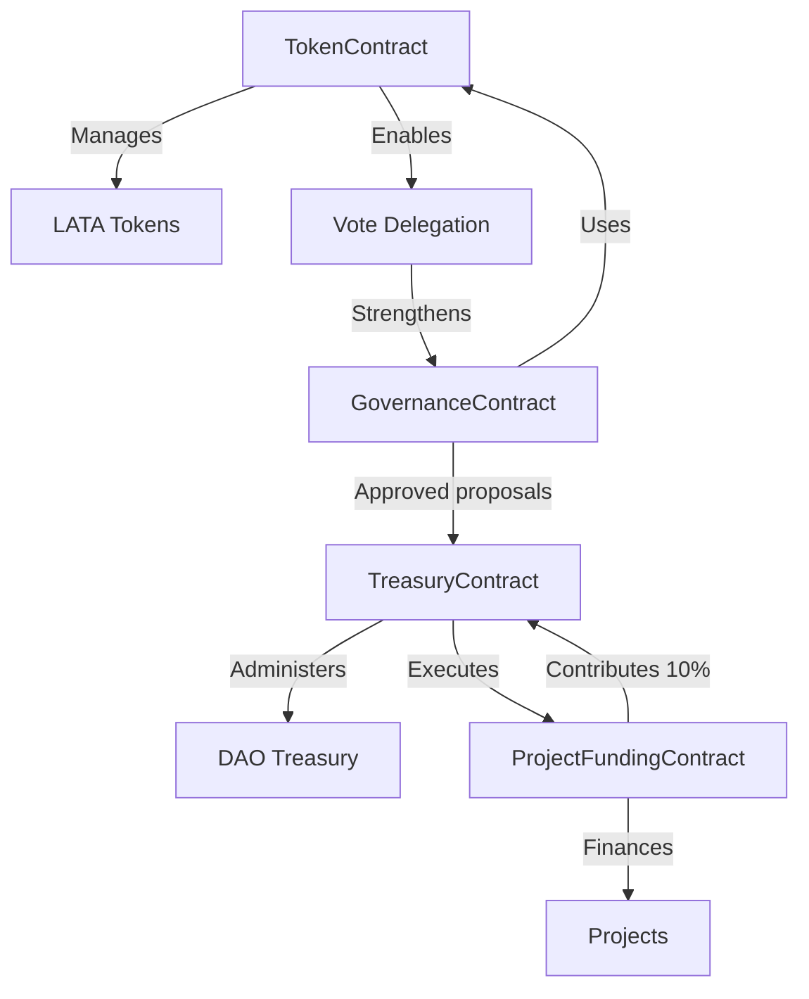
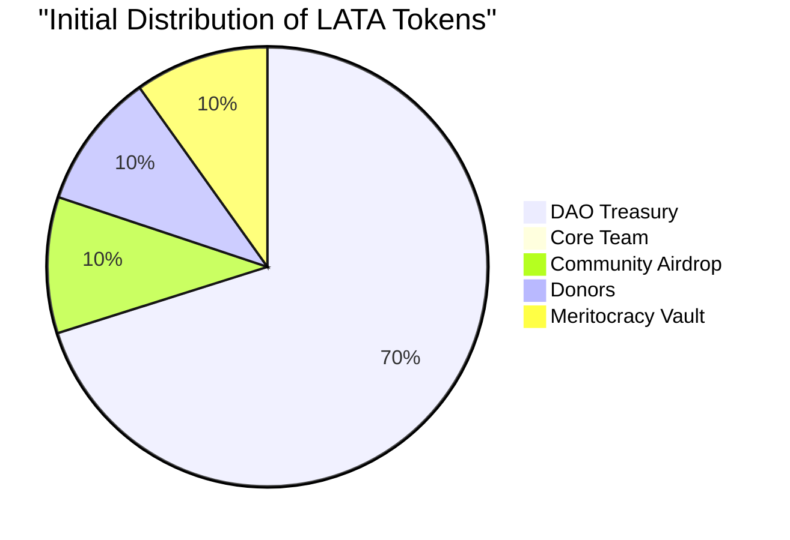
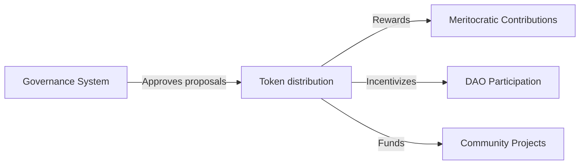
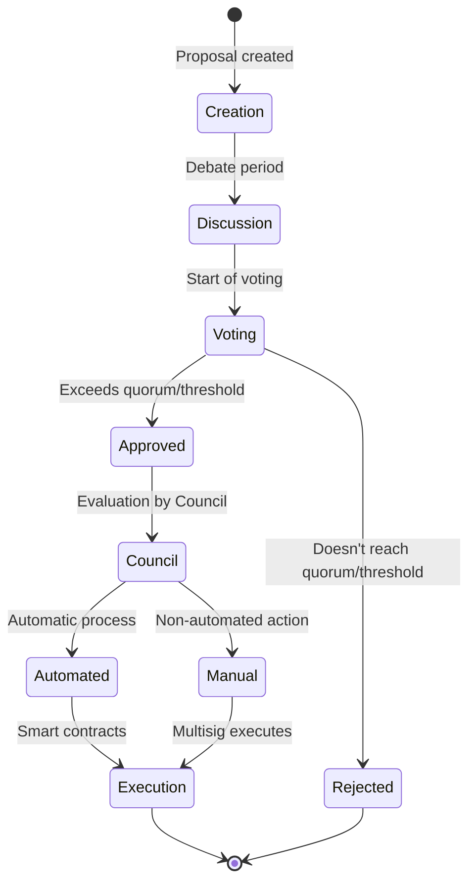
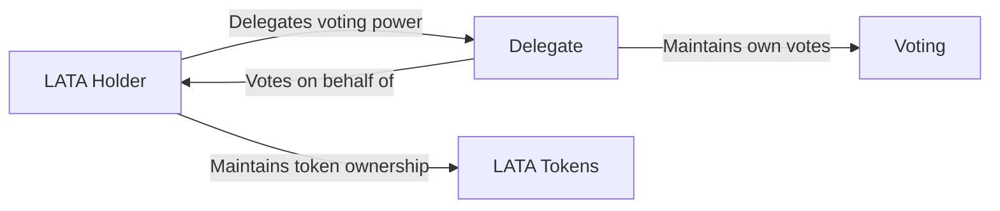
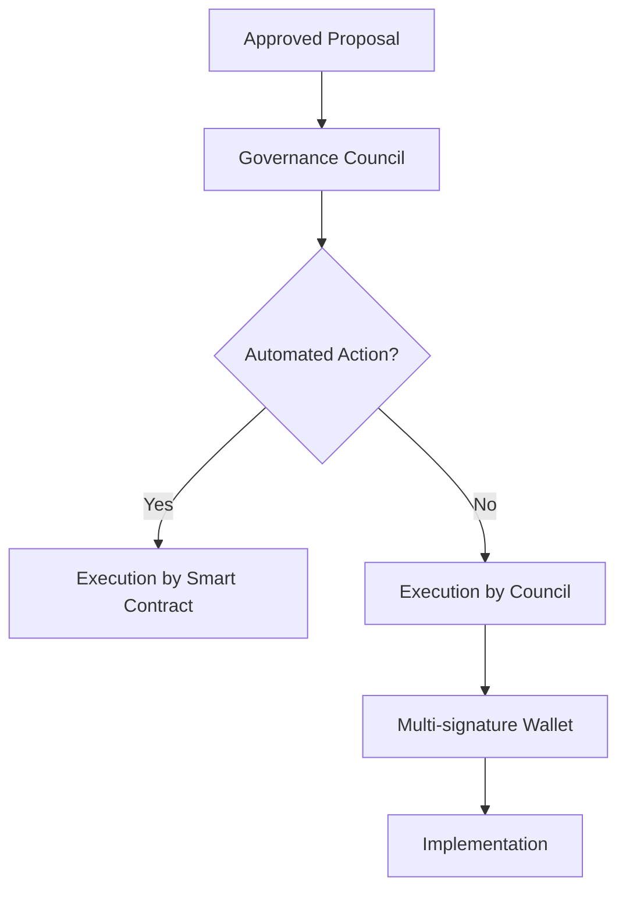
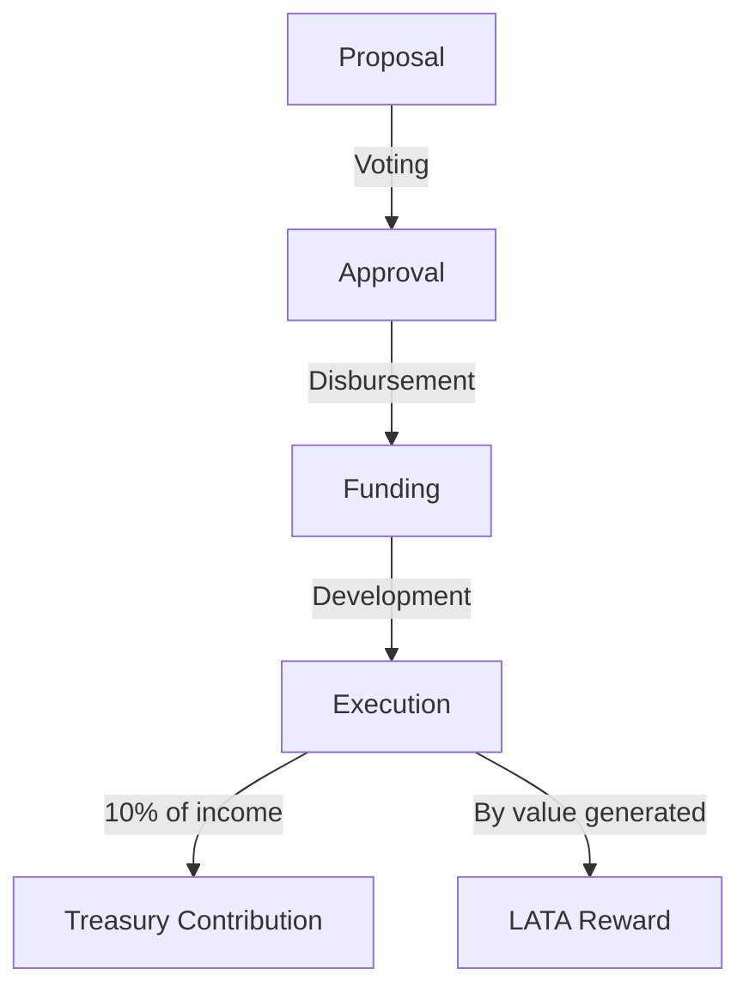

# EnceboDAO: Yellow Paper

**Take your EnceboDAO to $LATA mi ñaño**

## Abstract

What's up! This document details the technical, economic, and governance architecture of EnceboDAO, a flavorful decentralized autonomous organization designed to foster the growth of the web3 ecosystem in Ecuador. Through tokenized incentive mechanisms, decentralized voting systems, and transparent treasury management, EnceboDAO establishes a framework for community participation, collective decision-making, and the development of projects with local impact that, like a good encebollado, nourish the soul.

## 1. Introduction

EnceboDAO (derived from "Encebollado," the famous Ecuadorian soup) is an organization represented by rules encoded in smart contracts, characterized by its transparency, censorship resistance, and decentralized governance. Just as encebollado is a dish that unites Ecuadorians, our DAO seeks to increase community members' engagement and sense of belonging through the use of web3 platforms, promoting transparency, decentralization, and inclusion in all its processes.

Our motto: **"Take your EnceboDAO to $LATA mi ñaño"** represents the invitation to all Ecuadorians to participate in this community project, where everyone can contribute with their ingredients (skills) to make the best encebollado (ecosystem) possible.

## 2. Fundamental Principles

EnceboDAO's architecture is based on the following principles:

1. **Decentralization**: Decision-making must be distributed among community members, like the ingredients in a good encebollado.
2. **Transparency**: All operations, transactions, and decisions must be verifiable on the blockchain, clear as the broth of a well-made encebollado.
3. **Meritocracy**: Contributions to the community are recognized and rewarded proportionally, just as we appreciate the one who cooks the best encebollado.
4. **Sustainability**: The economic structure must guarantee the long-term viability of the organization, so that the pot never empties.
5. **Inclusivity**: Minimal entry barriers for new community members, because encebollado is for everyone.

## 3. Technical Architecture

### 3.1 Deployment Network

The DAO infrastructure has been implemented on **Arbitrum**, a Layer 2 solution for Ethereum, selected for its advantages:

- Low transaction costs compared to Ethereum mainnet (so it doesn't leave your pockets empty!)
- High security inherited from Ethereum
- Established ecosystem of tools for DAOs
- Full compatibility with ERC-20 and ERC-721 standards
- Fast confirmation times (faster than serving a hot encebollado!)

### 3.2 Management Platform

The DAO uses **Aragon** as the main platform for its creation and administration, leveraging its features:

- Intuitive interface for DAO creation and management
- Preconfigured modules for voting, finances, and memberships
- Wide compatibility with Arbitrum
- Integrated treasury management tools
- Extensibility through custom plugins

### 3.3 System Components

#### 3.3.1 Smart Contracts



The system consists of the following interconnected smart contracts:

1. **TokenContract**: ERC-20 implementation of the LATA governance token.
   - Controlled emission functions
   - Automated distribution mechanisms
   - Interface for balance queries and voting rights

2. **GovernanceContract**: Proposal and voting system.
   - Submission and management of proposals
   - Token-weighted voting
   - Automatic execution of approved proposals

3. **TreasuryContract**: Community fund management.
   - Interface for multisig of authorized signers
   - Transparent record of income and expenses
   - Automation of distributions and contributions

4. **ProjectFundingContract**: Project funding and management.
   - Request for project funds
   - Payment distribution to executors
   - Automatic 10% contribution to treasury

### 3.4 Governance Council and Multi-signature Wallet

Treasury management and DAO administration is carried out through a Governance Council that uses a multi-signature wallet on Arbitrum to execute approved decisions. The Governance Council was formed through an open call made on the Telegram channel of the core team, and is composed of seven members: Alex, Nico, Chris, Marcos, Nathalia, Paul, and David. This council and its associated wallet have the ability to:

- Execute decisions approved by voting (the voice of the people is the voice of God, my friend!)
- Manage treasury funds
- Perform technical updates when necessary
- Respond to emergency situations (like when we run out of hot sauce for the encebollado!)

## 4. Economic Model

### 4.1 Tokenomics

#### 4.1.1 Governance Token

- **Name and Symbol**: LATA
- **Description**: Inspired by the Ecuadorian colloquial expression for the "Sucre" currency
- **Standard**: ERC-20 with ERC-20Votes extension on Arbitrum
- **Divisibility**: 18 decimals
- **Initial Total Supply**: 10,000 LATA
- **Special Features**: Integrated vote delegation system (for when you're too busy eating encebollado!)

#### 4.1.2 Initial Distribution

The initial supply of 10,000 LATA is distributed as follows:



1. **DAO Treasury**: 7,000 LATA (70%)
   - Managed through the multi-signature wallet
   - Intended to fund community projects and operations
   - Further distribution through proposals approved by the governance system

2. **Core Team**: 17 LATA (0.17%)
   - 1 LATA for each of the 17 active members of the core team
   - Includes founders and main contributors
   - Because in EnceboDAO we all start equal, like brothers!

3. **Community Airdrop**: 1,000 LATA (10%)
   - Distribution through verified airdrop
   - 1 LATA per participant who meets the conditions
   - Managed through platforms like Galxe or Guild.xyz

4. **Donors**: 1,000 LATA (10%)
   - Reserved to reward initial economic donations
   - The distribution of governance tokens is symbolic for donors
   - Meritocracy is incentivized over economic contributions (effort is worth more than money!)

5. **Meritocracy Vault**: 983 LATA (9.83%)
   - Reserved to reward future meritorious contributions
   - Higher reward rate than economic donations

#### 4.1.3 Community Airdrop

The community airdrop follows these conditions:

- **Participation requirements**:
  - Follow ETHEcuador and Crypto Activos Podcast on X
  - Repost the governance token airdrop publication
  - Complete all required tasks on the airdrop platform

- **Management**:
  - The airdrop will be managed through platforms like Galxe or Guild.xyz
  - Automatic verification of requirements
  - Distribution of 1 LATA to each verified participant

- **Timeline**:
  - Launch of call: May 1, 2025
  - Socialization and registration period: 15 days
  - Token distribution: within 7 days after closing

#### 4.1.4 Expanded Distribution



The additional emission of tokens post-launch will occur through:

1. **Governance-Approved Proposals**:
   - Members can propose the distribution of treasury tokens
   - Each proposal must specify recipients, amounts, and justification
   - The community votes to approve or reject the distribution
   - Because the people rule, my friend!

2. **Rewards for Meritocratic Contributions**:
   - Event organization: 100 LATA per small event (scalable according to impact)
   - Technical development: LATA proportional to effort and value generated
   - Community management: LATA for administrative and coordination tasks
   - *Higher valuation than rewards for economic donations*

3. **Treasury Donations**:
   - Base conversion rate: 10 LATA for each 1 USD donated
   - Mechanism implemented through smart contract

4. **Project Contributions**:
   - 20 LATA for each 1 USD generated by community projects
   - 10% of project income automatically allocated to treasury

### 4.2 Sustainability Model

The DAO's financial sustainability is based on:

1. **Direct Donations**: Voluntary contributions to the treasury
2. **Project Percentage**: 10% of the income from community projects
3. **Grants and External Funding**: Grants from foundations and blockchain ecosystems

## 5. Governance System

### 5.1 Decision Structure



#### 5.1.1 Types of Proposals

1. **Funding Proposals**: Request for funds for projects or initiatives (so the party never stops!)
2. **Parameter Change Proposals**: Modifications to the DAO configuration
3. **Integration Proposals**: Incorporation of new tools or protocols
4. **Improvement Proposals**: Changes in processes or smart contracts
5. **Distribution Proposals**: Allocation of LATA tokens to members or collaborators

#### 5.1.2 Voting Process

1. **Proposal Creation**: Any member with the required minimum of tokens can create proposals
2. **Discussion Period**: Time allocated for community debate (where everyone puts their spoon in!)
3. **Active Voting**: Token holders cast weighted votes (1 token = 1 vote)
4. **Execution**: Implementation by the multisig of approved proposals that exceed the quorum threshold

#### 5.1.3 Governance Parameters

- **Proposal Threshold**: 10 LATA minimum to submit proposals
- **Voting Duration**: 5 days for voting period
- **Quorum**: 10% of participating tokens required
- **Approval Threshold**: 51% of affirmative votes needed

#### 5.1.4 Vote Delegation



EnceboDAO implements a vote delegation system that allows members to transfer their voting power to other participants without ceding ownership of their tokens. Main features:

- **Flexible Delegation**: Any LATA holder can delegate their voting power to another member
- **Revocation at Any Time**: Delegation can be revoked by the original holder whenever desired
- **Partial or Total Delegation**: Possibility to delegate only a portion of tokens
- **Transparency**: All delegations are recorded on the blockchain and are publicly verifiable
- **No Transfer of Ownership**: The delegator maintains full ownership of their tokens
- **Transitive Delegation**: A delegate can in turn delegate the received votes (configurable according to community preference)

### 5.2 Treasury Management

#### 5.2.1 Governance Council

EnceboDAO has a Governance Council formed by active community members, responsible for executing any non-automated action that has been approved through the formal proposal and voting process.



This council is responsible for:
- Faithfully interpreting and executing community decisions
- Coordinating technical and administrative actions (like a good encebollado chef!)
- Supervising project implementation
- Maintaining transparent communication about executed actions
- Representing the DAO in external relations

The council members were chosen after an open call on the Telegram channel of the core team, where their consistent participation and significant contributions to the project were evaluated.

#### 5.2.2 Multi-signature Wallet

Treasury management is carried out through the multi-signature wallet controlled by the seven members of the Governance Council (Alex, Nico, Chris, Marcos, Nathalia, Paul, and David). The configuration requires the approval of a subset of signatories to execute transactions.

#### 5.2.3 Funding Flow

1. **Funds Reception**:
   - Direct donations (the generosity of the community!)
   - Project contributions (automatic 10%)
   - External grants

2. **Fund Disbursement**:
   - Approval through voting
   - Execution by multisig signers
   - Transparent record on the blockchain

### 5.3 Project Execution

#### 5.3.1 Project Lifecycle



1. **Proposal**: Detailed presentation with objectives, budget, and deliverables
2. **Voting**: Approval by the community through weighted voting
3. **Funding**: Fund disbursement according to predefined milestones
4. **Execution**: Project development with periodic updates
5. **Contribution**: Automatic 10% return to treasury
6. **Reward**: Token issuance proportional to contribution

#### 5.3.2 Meritocracy

Project allocation prioritizes members with a proven track record of:

- Active participation in the community (not just in words but in deeds!)
- Successful execution of previous projects
- Significant contributions to the ecosystem

Rewards for meritocratic contributions are significantly higher than those granted for economic donations, incentivizing active participation over passive contributions.

## 6. Technical Implementation

### 6.1 Smart Contracts

#### 6.1.1 TokenContract

```solidity
// SPDX-License-Identifier: MIT
pragma solidity ^0.8.0;

import "@openzeppelin/contracts/token/ERC20/extensions/ERC20Votes.sol";
import "@openzeppelin/contracts/access/AccessControl.sol";

contract LataToken is ERC20Votes, AccessControl {
    bytes32 public constant MINTER_ROLE = keccak256("MINTER_ROLE");
    
    constructor() ERC20("Lata", "LATA") ERC20Permit("Lata") {
        _grantRole(DEFAULT_ADMIN_ROLE, msg.sender);
        _grantRole(MINTER_ROLE, msg.sender);
        
        // Initial supply of 10,000 LATA
        uint256 initialSupply = 10000 * 10**decimals();
        _mint(msg.sender, initialSupply);
    }
    
    function mint(address to, uint256 amount) public onlyRole(MINTER_ROLE) {
        _mint(to, amount);
    }
    
    // The following functions are overrides required by Solidity
    function _afterTokenTransfer(address from, address to, uint256 amount) internal override(ERC20Votes) {
        super._afterTokenTransfer(from, to, amount);
    }

    function _mint(address to, uint256 amount) internal override(ERC20Votes) {
        super._mint(to, amount);
    }

    function _burn(address account, uint256 amount) internal override(ERC20Votes) {
        super._burn(account, amount);
    }
}
```

#### 6.1.2 ProjectFundingContract

```solidity
// SPDX-License-Identifier: MIT
pragma solidity ^0.8.0;

import "@openzeppelin/contracts/access/Ownable.sol";
import "./LataToken.sol";

contract ProjectFunding is Ownable {
    LataToken public token;
    address public treasury;
    uint256 public treasuryFeePercentage = 10;
    
    // Reward rates
    uint256 public donationRewardRate = 10; // 10 LATA per 1 USD donated
    uint256 public projectContributionRate = 20; // 20 LATA per 1 USD from projects
    
    constructor(address _token, address _treasury) {
        token = LataToken(_token);
        treasury = _treasury;
    }
    
    function executePayment(address recipient, uint256 amount) public onlyOwner {
        uint256 treasuryAmount = (amount * treasuryFeePercentage) / 100;
        uint256 recipientAmount = amount - treasuryAmount;
        
        // Transfer funds to recipient
        (bool success1, ) = recipient.call{value: recipientAmount}("");
        require(success1, "Transfer to recipient failed");
        
        // Transfer fee to treasury
        (bool success2, ) = treasury.call{value: treasuryAmount}("");
        require(success2, "Transfer to treasury failed");
        
        // Mint tokens for the recipient based on contribution rate
        uint256 tokensToMint = amount * projectContributionRate; // 20 tokens per $1
        token.mint(recipient, tokensToMint);
    }
    
    function processDonation(address donor) public payable {
        require(msg.value > 0, "Donation amount must be greater than 0");
        
        // Transfer donation to treasury
        (bool success, ) = treasury.call{value: msg.value}("");
        require(success, "Transfer to treasury failed");
        
        // Calculate tokens to mint based on USD value
        // This assumes 1 ETH = X USD, would need oracle in production
        uint256 usdValue = calculateUsdValue(msg.value);
        uint256 tokensToMint = usdValue * donationRewardRate; // 10 tokens per $1
        
        // Mint tokens for donor
        token.mint(donor, tokensToMint);
    }
    
    function calculateUsdValue(uint256 ethAmount) internal pure returns (uint256) {
        // This is a placeholder - production would use Chainlink or similar oracle
        uint256 ethUsdPrice = 3000; // Example: 1 ETH = $3000 USD
        return (ethAmount * ethUsdPrice) / 1 ether;
    }
    
    receive() external payable {
        processDonation(msg.sender);
    }
}
```

### 6.2 Current Implementation Status

The DAO has been created and is active on Arbitrum using the Aragon platform. The LATA token has been deployed and the Governance Council's multi-signature wallet is operational. Implementation stages include:

1. **DAO Creation**: Successfully completed by the Governance Council.

2. **Token Configuration**: The LATA token has been deployed with an initial supply of 10,000 tokens.

3. **Initial Distribution**:
   - 7,000 LATA (70%) allocated to the DAO treasury
   - 17 LATA (0.17%) for the core team (1 LATA per member)
   - 1,000 LATA (10%) for the community airdrop
   - 1,000 LATA (10%) for donors
   - 983 LATA (9.83%) in the meritocracy vault

4. **Launch of Call and Socialization**:
   - Official publication on ETHEcuador social networks
   - Outreach campaign on Telegram and Discord channels
   - Explanatory webinars about the DAO and how to participate
   - Tutorials for wallet setup and airdrop participation

5. **Airdrop Implementation**:
   - Platform configuration (Galxe or Guild.xyz)
   - Establishment of participation requirements
   - Socialization and registration period
   - Verification and token distribution

6. **Next steps**:
   - Full activation of governance mechanisms
   - Processing of first formal proposals
   - Additional token distribution through approved proposals
   - Community expansion and project development

## 7. Conclusion

EnceboDAO represents an innovative model of community organization based on blockchain technology, designed to encourage participation, recognize contributions, and manage resources in a transparent and decentralized manner. Just as encebollado nourishes the Ecuadorian body, our DAO will nourish Ecuador's web3 ecosystem.

The implementation on Arbitrum using Aragon, with the LATA token as a governance mechanism, provides a solid technical foundation with minimized operating costs. The balanced distribution model, open call, and community airdrop system establish the foundations for inclusive and sustainable growth.

This Yellow Paper establishes the technical, economic, and governance parameters that guide the development and implementation of EnceboDAO, subject to refinement through the community governance mechanisms described herein.

---

*This document represents the technical specification of EnceboDAO and is subject to modifications through community governance processes. Take your EnceboDAO to $LATA mi ñaño!*
