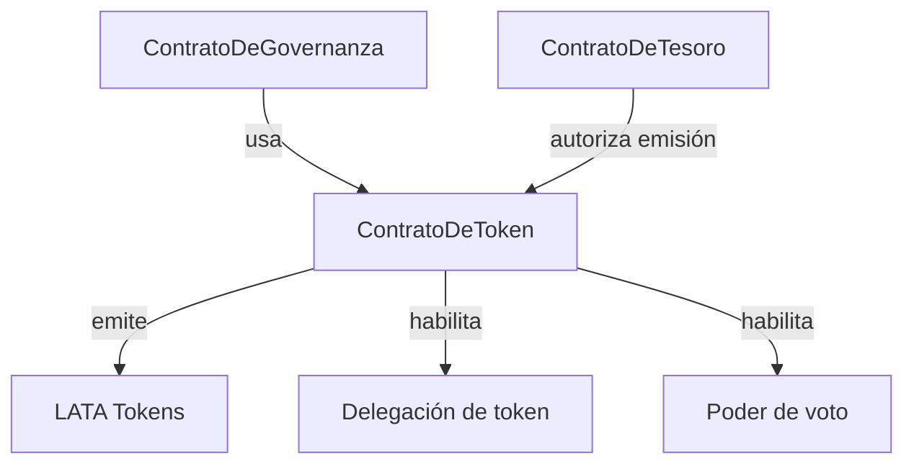
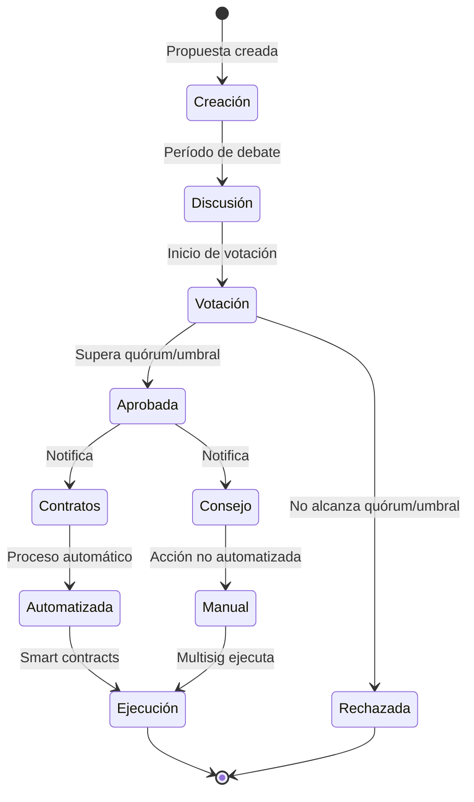
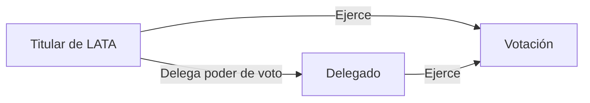
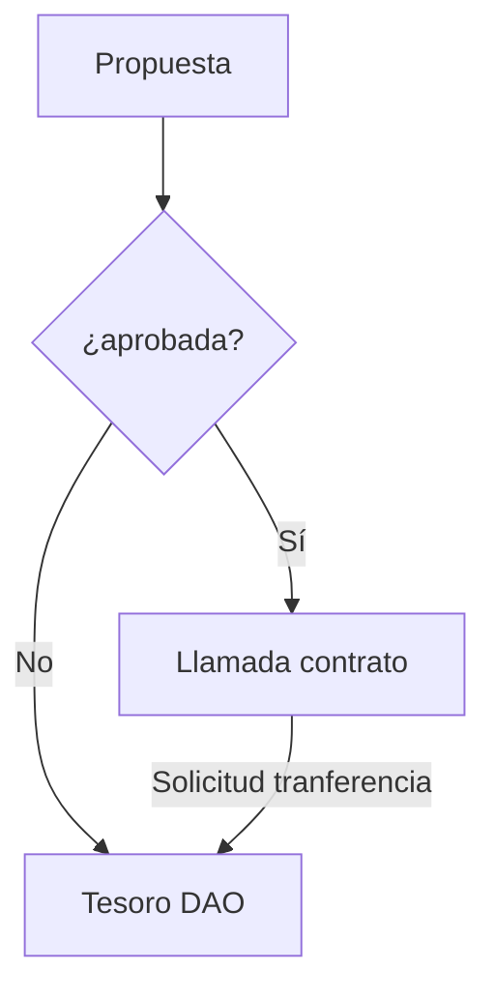

# EnceboDAO: Yellow Paper

## Resumen

Este documento detalla la arquitectura técnica, económica y de gobernanza de la DAO de la comunidad de EthEcuador, una organización autónoma descentralizada diseñada para fomentar el crecimiento del ecosistema web3 en Ecuador. A través de mecanismos de incentivos tokenizados, sistemas de votación descentralizados y gestión transparente del tesoro, EthEcuador DAO establece un marco para la participación comunitaria, la toma de decisiones colectivas y el desarrollo de proyectos con impacto local.

## 1. Introducción

EnceboDAO (Derivado de "Encebollado", la sopa más famosa de Ecuador) es una organización, con el toque ecuatoriano, representada por reglas codificadas en contratos inteligentes, caracterizada por su transparencia, resistencia a la censura y gobernanza descentralizada. La DAO busca aumentar el compromiso y sentido de pertenencia de los miembros de la comunidad mediante el uso de plataformas web3, promoviendo la transparencia, descentralización e inclusión en todos sus procesos.

## 2. Principios Fundamentales

La arquitectura de EnceboDAO se basa en los siguientes principios:

1. **Descentralización**: La toma de decisiones debe distribuirse entre los miembros de la comunidad.
2. **Transparencia**: Todas las operaciones, transacciones y decisiones deben ser verificables en la blockchain.
3. **Meritocracia**: Las contribuciones a la comunidad son reconocidas y recompensadas proporcionalmente.
4. **Sostenibilidad**: La estructura económica debe garantizar la viabilidad a largo plazo de la organización.
5. **Inclusividad**: Barreras mínimas de entrada para nuevos miembros de la comunidad.

## 3. Arquitectura Técnica

### 3.1 Red de Despliegue

El despligue será en **Arbitrum**, una solución capa 2 para Ethereum, seleccionada por sus ventajas:

- Bajos costos de transacción en comparación con Ethereum mainnet.
- Alta seguridad heredada de Ethereum.
- Ecosistema establecido de herramientas para DAOs.
- Compatibilidad completa con estándares ERC-20 y ERC-721.
- Tiempos de confirmación rápidos.

### 3.2 Plataforma de Gestión

La DAO utiliza **Aragon** como plataforma principal para su creación y administración, aprovechando sus características:

- Interfaz intuitiva para creación y gestión de DAOs
- Módulos preconfigurados para votación, finanzas y membresías
- Amplia compatibilidad con Arbitrum
- Herramientas de gestión de tesoro integradas
- Capacidad de extensión mediante plugins personalizados

### 3.3 Componentes del Sistema

#### 3.3.1 Contratos Inteligentes

El sistema consta de los siguientes contratos inteligentes interconectados:

1. **ContratoDeToken**: Implementación ERC-20 del token de gobernanza LATA.
   - Funciones de emisión controlada por el contrato de tesoro y mediante la aprobación de propuestas.
   - Mecanismos de distribución automatizada.
   - Interfaz para consulta de balances y derechos de voto.

2. **ContratoDeGovernanza**: Sistema de propuestas y votación.
   - Presentación y gestión de propuestas.
   - Votación ponderada por tokens.
   - Ejecución automática de propuestas aprobadas.
   - Basado en los contratos de Aragón.

3. **TreasuryContract**: Gestión de fondos comunitarios.
   - Billetera multi-firma del consejo de gobernanza para implementar cambios.
   - Implementación de reglas de emisión y distribución aprobadas por el sistema de gobernanza.

### 3.4 Consejo de Gobernanza

El Consejo de Gobernanza de EthEcuador DAO se encarga de facilitar la ejecución de decisiones aprobadas por la comunidad a través del sistema de votación en Aragon.

Este consejo tiene la capacidad de:

- Ejecutar decisiones técnicas aprobadas mediante votación que no puedan automatizarse.
- Crear contratos o modificar los contratos existentes y ligarlos a las propuestas, para que desplieguen cuando sean aprobadas.
- Realizar actualizaciones técnicas cuando sea necesario.
- Responder a situaciones de emergencia.
- Representar a la DAO en relaciones externas.

A diferencia de modelos tradicionales, el Consejo no gestiona directamente los fondos del tesoro, ya que este proceso se auto-regula mediante la emisión controlada de tokens a través de insignias de asistencia y propuestas aprobadas por la comunidad en Aragon.

## 4. Modelo Económico

### 4.1 Tokenomics

#### 4.1.1 Token de Gobernanza

- **Nombre y Símbolo**: LATA
- **Descripción**: Inspirado en la expresión coloquial ecuatoriana para referirse a la moneda "Sucre".
- **Estándar**: ERC-20 con extensión ERC-20Votes en Arbitrum.
- **Divisibilidad**: 18 decimales.
- **Suministro Total Inicial**: 0 LATA (emisión progresiva)
- **Características Especiales**: Sistema de delegación de votos integrado.

#### 4.1.2 Distribución y Emisión

La emisión de LATA sigue un modelo progresivo donde el **suministro inicial es cero y crece orgánicamente** a través de dos mecanismos principales:

1. **Reclamo de Insignias de Asistencia**: 
   - Las insignias son emitidas a través de la plataforma poap.xyz.
   - Cada insignia representa asistencia verificada a eventos o llamadas comunitarias.
   - Los poseedores de insignias pueden reclamar 1 LATA por cada insignia (canje único).
   - El contrato del token incluye mecanismos de verificación de insignias.

2. **Propuestas de Gobernanza**:
   - La comunidad puede aprobar emisiones adicionales mediante votación.
   - Permite flexibilidad para recompensar contribuciones excepcionales o campañas.

Este modelo de emisión progresiva incentiva la participación activa y la asistencia, alineando la distribución de tokens con el compromiso real demostrado por los miembros.

#### 4.1.3 Crecimiento y difusión.

Las campañas se gestionará a través de la plataforma Galxe:

- **Campañas de Crecimiento**: Diseñadas para aumentar la difusión y el tamaño de la comunidad.
- **Misiones Estratégicas**: Actividades como republicar contenido en X, seguir proyectos relacionados, etc.
- **Verificación de Participación**: Sistema de puntos y credenciales verificables.
- **Reclamación de Tokens**: Mecanismo automatizado al completar las misiones asignadas.

Este enfoque permite una distribución controlada y orientada a la expansión estratégica de la comunidad, incentivando acciones que beneficien al ecosistema de EthEcuador.

#### 4.1.4 Tabla referencial de Recompensas LATA

| Actividad | Recompensa |
|-----------|------------|
| Meritocracia | Recompensa mayor (variable) |
| Donaciones directas | 1 LATA por cada 100 USD |
| Proyectos Comunitarios | 1 LATA por cada 10 USD |
| Evento pequeño | 5 LATA por evento |
| Evento Mediano | 10 LATA por evento |
| Evento Grande | 50 LATA por evento |

La emisión de tokens post-lanzamiento se produce mediante:

1. **Recompensas por Contribuciones Meritocráticas**:
   - Organización de eventos: 100 LATA por evento pequeño (escalable según impacto)
   - Desarrollo técnico: LATA proporcionales al esfuerzo y valor generado
   - Gestión comunitaria: LATA por tareas administrativas y de coordinación
   - Asistencia a eventos/llamadas: Los participantes recibirán insignias on-chain intransferibles que podrán canjear por 1 LATA cada una (canje único). Las insignias incluirán protección mediante palabra clave, validez temporal limitada y solo podrán ser reclamadas por asistentes verificados.
   - *Valoración superior a las recompensas por donaciones económicas*

2. **Donaciones al Tesoro**:
   - Tasa de conversión base: 1 LATA por cada 100 USD donado.
   - Mecanismo implementado mediante contrato inteligente.

3. **Contribuciones de Proyectos**:
Esto se refiere a proyectos que usen como plataforma la comunidad para su desarrollo o crecimiento.
   - 1 LATA por cada 1 USD generado por proyectos comunitarios.
   - 5% de ingresos de proyectos destinado automáticamente al tesoro.
   - 10% de los subvenciones conseguidos y gestionados mediante la comunidad.

### 4.2 Modelo de Sostenibilidad

La sostenibilidad financiera de la DAO se basa en:

1. **Donaciones Directas**: Contribuciones voluntarias al tesoro.
2. **Porcentaje de Proyectos**: De los ingresos de proyectos comunitarios.
3. **Grants y Financiamiento Externo**: Subvenciones de fundaciones y ecosistemas blockchain.

## 5. Sistema de Gobernanza

### 5.1 Estructura de Decisiones

#### 5.1.1 Tipos de Propuestas

1. **Propuestas de desarrollo de proyectos:** Propuestas de proyectos que pueden ser financiados o ejecutados por la comunidad.
3. **Propuestas de Cambio de Parámetros**: Modificaciones a la configuración de la DAO.
4. **Propuestas de Integración**: Incorporación de nuevas herramientas o protocolos.
5. **Propuestas de Mejora**: Cambios en los procesos o contratos inteligentes.

#### 5.1.2 Proceso de Votación

1. **Creación de Propuesta**: Cualquier miembro con el mínimo requerido de tokens puede crear propuestas.
2. **Período de Discusión**: Tiempo asignado para debate comunitario.
3. **Votación Activa**: Los titulares de tokens emiten votos ponderados (1 token = 1 voto).
4. **Ejecución**: Implementación por la multisig o directamente por los contratos aprobados de las propuestas aprobadas que superen el umbral de quórum.

#### 5.1.3 Parámetros de Gobernanza

- **Umbral de Propuesta**: 5 LATA mínimos para presentar propuestas.
- **Duración de Votación**: 8 días para período de votación.
- **Quórum**: 51% de tokens participantes requeridos.
- **Umbral de Aprobación**: 51% de votos afirmativos necesarios.

#### 5.1.4 Delegación de Votos

EnceboDAO implementa un sistema de delegación de votos que permite a los miembros transferir su poder de voto a otros participantes sin ceder la propiedad de sus tokens. Características principales:

- **Delegación Flexible**: Cualquier titular de LATA puede delegar su poder de voto a otro miembro
- **Revocación en Cualquier Momento**: La delegación puede ser revocada por el titular original cuando lo desee
- **Delegación Parcial o Total**: Posibilidad de delegar solo una parte de los tokens
- **Transparencia**: Todas las delegaciones quedan registradas en la blockchain y son públicamente verificables
- **Sin Transferencia de Propiedad**: El delegante mantiene la propiedad completa de sus tokens
- **Delegación Transitiva**: Un delegado puede a su vez delegar los votos recibidos (configurable según preferencia comunitaria)

### 5.2 Gestión del Tesoro

EnceboDAO implementa un modelo de gestión del tesoro gobernando mediante la ejecución atomática mediante las propuestas.
Las propuestas llevarán los parámetros de la cantidad y destinatario de la transferencia de fondos aprobadas por la comunidad mediante la propuesta y el sistema de gobernanza:

Este sistema descentralizado asegura que:
- Las decisiones sobre fondos se toman colectivamente a través de votaciones en Aragon
- La emisión de tokens está limitada por mecanismos verificables (POAPs)
- Los procesos de distribución son transparentes y rastreables en la blockchain

#### 5.2.2 Flujo de Financiamiento

1. **Recepción de Fondos**:
   - Donaciones directas
   - Contribuciones de proyectos (10% automático)
   - Subvenciones externas

2. **Desembolso de Fondos**:
   - Aprobación mediante votación en Aragon
   - Ejecución automática mediante contratos inteligentes cuando sea posible
   - Facilitación por el Consejo cuando se requiera intervención humana
   - Registro transparente en la blockchain

### 5.3 Meritocracia

La delegación de ejecución de los proyectos priorizará a miembros con historial comprobado de:

- Participación activa en planificación y gestión del proyecto.
- Cantidad de tokens de gobernanza.
- Contribuciones significativas al ecosistema.

Las recompensas por contribuciones meritocráticas son significativamente mayores que las otorgadas por donaciones económicas, incentivando la participación activa sobre las contribuciones pasivas.

### 6.2 Estado Actual de Implementación

El consejo de gobernanza está estudiando la nueva versión de Aragon Osx para implementar todo lo expuesto en este Yellow paper y ponerlo en práctica a nivel tecnológico, con el mayor grado de automatización posible, más sin embargo ya se va a empezar con la emisión de las insigneas de asistencia a las reuniones y eventos en la plataforma poap.xyz.

4. **Próximos pasos**:
   - Creación de los contrato inteligentes compatibles con la plataforma Aragon.
   - Socialización del Yellow paper y de la versión más resumida mediante publicaciones en redes sociales y reunión semanal.
   - Creación de la DAO en la red de pruebas Sepolia.
   - Pruebas del equipo core de la DAO.
   - Retroalimentación y ajustes.
   - Despliege en la red Arbitrum.
   - Socialización.
   - Reclamación de la tokens de gobernanza.
   - Primeras propuestas.
   - Campañas de crecimiento.

## 7. Conclusión

EnceboDAO representa un modelo innovador de organización comunitaria basada en tecnología blockchain, diseñada para fomentar la participación, reconocer contribuciones y gestionar recursos de manera transparente y descentralizada. A través de su sistema de gobernanza tokenizado e incentivo a meritocracia, la DAO establece las bases para el crecimiento sostenible del ecosistema web3 en Ecuador.
