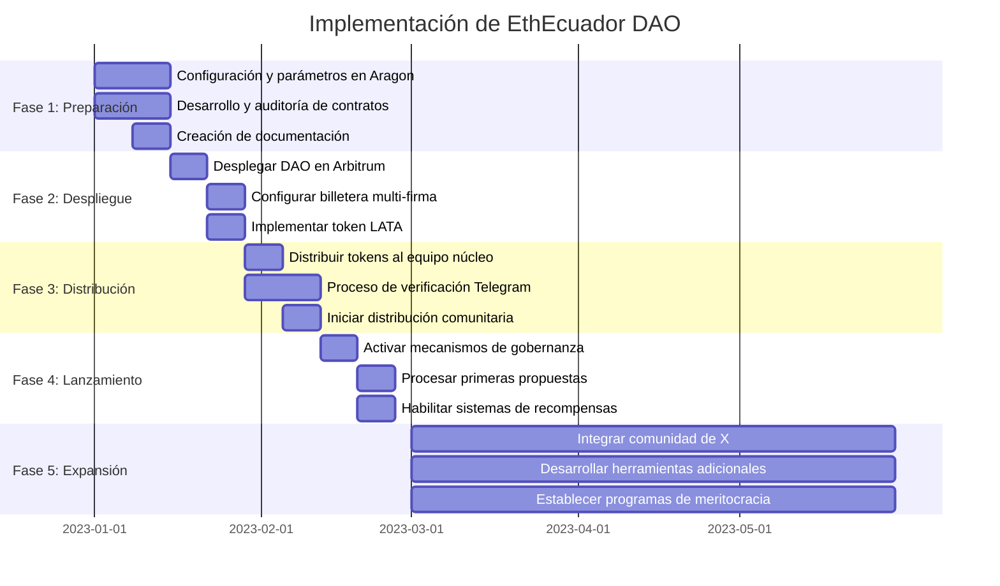

# EthEcuador DAO: Yellow Paper

## Resumen

Este documento detalla la arquitectura técnica, económica y de gobernanza de EthEcuador DAO, una organización autónoma descentralizada diseñada para fomentar el crecimiento del ecosistema web3 en Ecuador. A través de mecanismos de incentivos tokenizados, sistemas de votación descentralizados y gestión transparente del tesoro, EthEcuador DAO establece un marco para la participación comunitaria, la toma de decisiones colectivas y el desarrollo de proyectos con impacto local.

## 1. Introducción

EthEcuador DAO es una organización representada por reglas codificadas en contratos inteligentes, caracterizada por su transparencia, resistencia a la censura y gobernanza descentralizada. La DAO busca aumentar el compromiso y sentido de pertenencia de los miembros de la comunidad mediante el uso de plataformas web3, promoviendo la transparencia, descentralización e inclusión en todos sus procesos.

## 2. Principios Fundamentales

La arquitectura de EthEcuador DAO se basa en los siguientes principios:

1. **Descentralización**: La toma de decisiones debe distribuirse entre los miembros de la comunidad.
2. **Transparencia**: Todas las operaciones, transacciones y decisiones deben ser verificables en la blockchain.
3. **Meritocracia**: Las contribuciones a la comunidad son reconocidas y recompensadas proporcionalmente.
4. **Sostenibilidad**: La estructura económica debe garantizar la viabilidad a largo plazo de la organización.
5. **Inclusividad**: Barreras mínimas de entrada para nuevos miembros de la comunidad.

## 3. Arquitectura Técnica

### 3.1 Red de Despliegue

La infraestructura de la DAO se implementará en **Arbitrum**, una solución Layer 2 para Ethereum, seleccionada por sus ventajas:

- Bajos costos de transacción en comparación con Ethereum mainnet
- Alta seguridad heredada de Ethereum
- Ecosistema establecido de herramientas para DAOs
- Compatibilidad completa con estándares ERC-20 y ERC-721
- Tiempos de confirmación rápidos

### 3.2 Plataforma de Gestión

La DAO utilizará **Aragon** como plataforma principal para su creación y administración, aprovechando sus características:

- Interfaz intuitiva para creación y gestión de DAOs
- Módulos preconfigurados para votación, finanzas y membresías
- Amplia compatibilidad con Arbitrum
- Herramientas de gestión de tesoro integradas
- Capacidad de extensión mediante plugins personalizados

### 3.3 Componentes del Sistema

#### 3.3.1 Contratos Inteligentes

El sistema constará de los siguientes contratos inteligentes interconectados:


1. **TokenContract**: Implementación ERC-20 del token de gobernanza LATA.
   - Funciones de emisión controlada
   - Mecanismos de distribución automatizada
   - Interfaz para consulta de balances y derechos de voto

2. **GovernanceContract**: Sistema de propuestas y votación.
   - Presentación y gestión de propuestas
   - Votación ponderada por tokens
   - Ejecución automática de propuestas aprobadas

3. **TreasuryContract**: Gestión de fondos comunitarios.
   - Interfaz para multisig de firmantes autorizados
   - Registro transparente de ingresos y gastos
   - Automatización de distribuciones y contribuciones

4. **ProjectFundingContract**: Financiamiento y gestión de proyectos.
   - Solicitud de fondos para proyectos
   - Distribución de pagos a ejecutores
   - Contribución automática del 10% al tesoro

### 3.4 Consejo de Gobernanza y Billetera Multi-firma

La gestión del tesoro y la administración de la DAO se realizará mediante un Consejo de Gobernanza que utilizará una billetera multi-firma en Arbitrum para ejecutar las decisiones aprobadas. **La convocatoria para formar parte de este consejo administrativo, cuyos miembros serán los firmantes de la billetera multifirma, fue realizada a través del canal de Telegram del equipo núcleo.** Este consejo y su billetera asociada tendrán la capacidad de:

- Ejecutar decisiones aprobadas mediante votación
- Gestionar los fondos del tesoro
- Realizar actualizaciones técnicas cuando sea necesario
- Responder a situaciones de emergencia

## 4. Modelo Económico

### 4.1 Tokenomics

#### 4.1.1 Token de Gobernanza

- **Nombre y Símbolo**: LATA
- **Descripción**: Inspirado en la expresión coloquial ecuatoriana para referirse a la moneda "Sucre"
- **Estándar**: ERC-20 con extensión ERC-20Votes en Arbitrum
- **Divisibilidad**: 18 decimales
- **Suministro Total Inicial**: 10,000 LATA
- **Características Especiales**: Sistema de delegación de votos integrado

#### 4.1.2 Distribución Inicial

El suministro inicial de 10,000 LATA se distribuirá de la siguiente manera:


1. **Tesoro de la DAO**: 5,000 LATA (50%)
   - Gestionado mediante la billetera multi-firma
   - Destinado a financiar proyectos comunitarios y operaciones

2. **Equipo Núcleo**: 1,000 LATA (10%)
   - 17 miembros activos × 58.82 LATA cada uno (redondeado)
   - Incluye fundadores y contribuyentes principales

3. **Comunidad Telegram**: 1,000 LATA (10%)
   - 128 miembros × 7.81 LATA cada uno (redondeado)
   - Distribución por miembro activo mediante proceso de verificación

4. **Donadores**: 1,000 LATA (10%)
   - Reservado para recompensar donaciones económicas iniciales
   - Tasa de distribución: 10 LATA por 1 USD donado

5. **Bóveda de Meritocracia**: 2,000 LATA (20%)
   - Reservado para recompensar contribuciones meritorias
   - Mayor tasa de recompensa que las donaciones económicas

#### 4.1.3 Distribución expandida (post-lanzamiento)

Para acomodar la distribución a la comunidad de X (756 seguidores), se contemplará una emisión adicional controlada:

- Establecer un programa de airdrop verificado
- Requerir interacción con la DAO para reclamar tokens
- Limitar a 1 LATA por seguidor verificado

#### 4.1.4 Generación Continua


La emisión de tokens post-lanzamiento se producirá mediante:

1. **Recompensas por Contribuciones Meritocráticas**:
   - Organización de eventos: 100 LATA por evento pequeño (escalable según impacto)
   - Desarrollo técnico: LATA proporcionales al esfuerzo y valor generado
   - Gestión comunitaria: LATA por tareas administrativas y de coordinación
   - *Valoración superior a las recompensas por donaciones económicas*

2. **Donaciones al Tesoro**:
   - Tasa de conversión base: 10 LATA por cada 1 USD donado
   - Mecanismo implementado mediante contrato inteligente

3. **Contribuciones de Proyectos**:
   - 20 LATA por cada 1 USD generado por proyectos comunitarios
   - 10% de ingresos de proyectos destinado automáticamente al tesoro

### 4.2 Modelo de Sostenibilidad

La sostenibilidad financiera de la DAO se basa en:

1. **Donaciones Directas**: Contribuciones voluntarias al tesoro
2. **Porcentaje de Proyectos**: 10% de los ingresos de proyectos comunitarios
3. **Grants y Financiamiento Externo**: Subvenciones de fundaciones y ecosistemas blockchain

## 5. Sistema de Gobernanza

### 5.1 Estructura de Decisiones


#### 5.1.1 Tipos de Propuestas

1. **Propuestas de Financiamiento**: Solicitud de fondos para proyectos o iniciativas
2. **Propuestas de Cambio de Parámetros**: Modificaciones a la configuración de la DAO
3. **Propuestas de Integración**: Incorporación de nuevas herramientas o protocolos
4. **Propuestas de Mejora**: Cambios en los procesos o contratos inteligentes

#### 5.1.2 Proceso de Votación

1. **Creación de Propuesta**: Cualquier miembro con el mínimo requerido de tokens puede crear propuestas
2. **Período de Discusión**: Tiempo asignado para debate comunitario
3. **Votación Activa**: Los titulares de tokens emiten votos ponderados (1 token = 1 voto)
4. **Ejecución**: Implementación por la multisig de propuestas aprobadas que superen el umbral de quórum

#### 5.1.3 Parámetros de Gobernanza

- **Umbral de Propuesta**: 10 LATA mínimos para presentar propuestas
- **Duración de Votación**: 5 días para período de votación
- **Quórum**: 10% de tokens participantes requeridos
- **Umbral de Aprobación**: 51% de votos afirmativos necesarios

#### 5.1.4 Delegación de Votos


EthEcuador DAO implementa un sistema de delegación de votos que permite a los miembros transferir su poder de voto a otros participantes sin ceder la propiedad de sus tokens. Características principales:

- **Delegación Flexible**: Cualquier titular de LATA puede delegar su poder de voto a otro miembro
- **Revocación en Cualquier Momento**: La delegación puede ser revocada por el titular original cuando lo desee
- **Delegación Parcial o Total**: Posibilidad de delegar solo una parte de los tokens
- **Transparencia**: Todas las delegaciones quedan registradas en la blockchain y son públicamente verificables
- **Sin Transferencia de Propiedad**: El delegante mantiene la propiedad completa de sus tokens
- **Delegación Transitiva**: Un delegado puede a su vez delegar los votos recibidos (configurable según preferencia comunitaria)

### 5.2 Gestión del Tesoro

#### 5.2.1 Consejo de Gobernanza

EthEcuador DAO contará con un Consejo de Gobernanza formado por miembros activos de la comunidad, responsables de ejecutar cualquier acción que no esté automatizada y que haya sido aprobada mediante el proceso formal de propuestas y votaciones. 


Este consejo será responsable de:
- Interpretar y ejecutar fielmente las decisiones comunitarias
- Coordinar acciones técnicas y administrativas
- Supervisar la implementación de proyectos
- Mantener la comunicación transparente sobre las acciones ejecutadas
- Representar a la DAO en relaciones externas

Los miembros del consejo serán elegidos por votación comunitaria, con renovación periódica para mantener la descentralización efectiva.

#### 5.2.2 Billetera Multi-firma

La gestión del tesoro se realizará mediante la billetera multi-firma controlada por los miembros del Consejo de Gobernanza. **Estos miembros fueron seleccionados a través de una convocatoria abierta realizada en el canal de Telegram del equipo núcleo, donde se evaluó su participación consistente y aportaciones significativas al proyecto.** La configuración requerirá la aprobación de un subconjunto de firmantes (ej. 4 de 7) para ejecutar transacciones.

#### 5.2.3 Flujo de Financiamiento

1. **Recepción de Fondos**:
   - Donaciones directas
   - Contribuciones de proyectos (10% automático)
   - Subvenciones externas

2. **Desembolso de Fondos**:
   - Aprobación mediante votación
   - Ejecución por firmantes de la multisig
   - Registro transparente en la blockchain

### 5.3 Ejecución de Proyectos

#### 5.3.1 Ciclo de Vida del Proyecto


1. **Propuesta**: Presentación detallada con objetivos, presupuesto y entregables
2. **Votación**: Aprobación por la comunidad mediante votación ponderada
3. **Financiamiento**: Desembolso de fondos según hitos predefinidos
4. **Ejecución**: Desarrollo del proyecto con actualizaciones periódicas
5. **Contribución**: Devolución automática del 10% al tesoro
6. **Recompensa**: Emisión de tokens proporcionales a la contribución

#### 5.3.2 Meritocracia

La asignación de proyectos priorizará a miembros con historial comprobado de:

- Participación activa en la comunidad
- Ejecución exitosa de proyectos anteriores
- Contribuciones significativas al ecosistema

Las recompensas por contribuciones meritocráticas serán significativamente mayores que las otorgadas por donaciones económicas, incentivando la participación activa sobre las contribuciones pasivas.

## 6. Implementación Técnica

### 6.1 Contratos Inteligentes

#### 6.1.1 TokenContract

```solidity
// SPDX-License-Identifier: MIT
pragma solidity ^0.8.0;

import "@openzeppelin/contracts/token/ERC20/extensions/ERC20Votes.sol";
import "@openzeppelin/contracts/access/AccessControl.sol";

contract LataToken is ERC20Votes, AccessControl {
    bytes32 public constant MINTER_ROLE = keccak256("MINTER_ROLE");
    
    constructor() ERC20("Lata", "LATA") ERC20Permit("Lata") {
        _grantRole(DEFAULT_ADMIN_ROLE, msg.sender);
        _grantRole(MINTER_ROLE, msg.sender);
        
        // Initial supply of 10,000 LATA
        uint256 initialSupply = 10000 * 10**decimals();
        _mint(msg.sender, initialSupply);
    }
    
    function mint(address to, uint256 amount) public onlyRole(MINTER_ROLE) {
        _mint(to, amount);
    }
    
    // The following functions are overrides required by Solidity
    function _afterTokenTransfer(address from, address to, uint256 amount) internal override(ERC20Votes) {
        super._afterTokenTransfer(from, to, amount);
    }

    function _mint(address to, uint256 amount) internal override(ERC20Votes) {
        super._mint(to, amount);
    }

    function _burn(address account, uint256 amount) internal override(ERC20Votes) {
        super._burn(account, amount);
    }
}
```

#### 6.1.2 ProjectFundingContract

```solidity
// SPDX-License-Identifier: MIT
pragma solidity ^0.8.0;

import "@openzeppelin/contracts/access/Ownable.sol";
import "./LataToken.sol";

contract ProjectFunding is Ownable {
    LataToken public token;
    address public treasury;
    uint256 public treasuryFeePercentage = 10;
    
    // Reward rates
    uint256 public donationRewardRate = 10; // 10 LATA per 1 USD donated
    uint256 public projectContributionRate = 20; // 20 LATA per 1 USD from projects
    
    constructor(address _token, address _treasury) {
        token = LataToken(_token);
        treasury = _treasury;
    }
    
    function executePayment(address recipient, uint256 amount) public onlyOwner {
        uint256 treasuryAmount = (amount * treasuryFeePercentage) / 100;
        uint256 recipientAmount = amount - treasuryAmount;
        
        // Transfer funds to recipient
        (bool success1, ) = recipient.call{value: recipientAmount}("");
        require(success1, "Transfer to recipient failed");
        
        // Transfer fee to treasury
        (bool success2, ) = treasury.call{value: treasuryAmount}("");
        require(success2, "Transfer to treasury failed");
        
        // Mint tokens for the recipient based on contribution rate
        uint256 tokensToMint = amount * projectContributionRate; // 20 tokens per $1
        token.mint(recipient, tokensToMint);
    }
    
    function processDonation(address donor) public payable {
        require(msg.value > 0, "Donation amount must be greater than 0");
        
        // Transfer donation to treasury
        (bool success, ) = treasury.call{value: msg.value}("");
        require(success, "Transfer to treasury failed");
        
        // Calculate tokens to mint based on USD value
        // This assumes 1 ETH = X USD, would need oracle in production
        uint256 usdValue = calculateUsdValue(msg.value);
        uint256 tokensToMint = usdValue * donationRewardRate; // 10 tokens per $1
        
        // Mint tokens for donor
        token.mint(donor, tokensToMint);
    }
    
    function calculateUsdValue(uint256 ethAmount) internal pure returns (uint256) {
        // This is a placeholder - production would use Chainlink or similar oracle
        uint256 ethUsdPrice = 3000; // Example: 1 ETH = $3000 USD
        return (ethAmount * ethUsdPrice) / 1 ether;
    }
    
    receive() external payable {
        processDonation(msg.sender);
    }
}
```

### 6.2 Distribución Inicial con Aragon

La implementación técnica con Aragon en Arbitrum seguirá estos pasos:

1. **Creación de la DAO**:
   - Desplegar la DAO a través de la interfaz de Aragon en Arbitrum
   - Configurar parámetros de votación (umbral, duración, quórum)
   - Establecer la billetera multi-firma como controlador

2. **Configuración del Token**:
   - Desplegar el token LATA con suministro inicial de 10,000
   - Integrar con el módulo de token de Aragon
   - Configurar permisos de minado controlados por la DAO

3. **Distribución Inicial**:
   - Asignar 5,000 LATA (50%) al tesoro de la DAO
   - Distribuir 58.82 LATA a cada uno de los 17 miembros del equipo núcleo
   - Reservar 1,000 LATA para la comunidad de Telegram (7.81 por miembro)
   - Reservar 1,000 LATA para recompensar donaciones
   - Reservar 2,000 LATA en la bóveda de meritocracia

4. **Automatización de Recompensas**:
   - Implementar contratos para recompensas por donaciones
   - Configurar sistema de distribución para la comunidad de Telegram
   - Establecer mecanismos de distribución de la bóveda de meritocracia

### 6.3 Hoja de Ruta de Implementación



1. **Fase 1: Preparación (Semanas 1-2)**
   - Finalizar la configuración y parámetros en Aragon
   - Desarrollar y auditar contratos inteligentes
   - Crear documentación técnica y guías de usuario

2. **Fase 2: Despliegue (Semanas 3-4)**
   - Desplegar DAO en Arbitrum mediante Aragon
   - Configurar billetera multi-firma con miembros activos
   - Implementar token LATA y mecanismos de distribución

3. **Fase 3: Distribución Inicial (Semanas 5-6)**
   - Distribuir tokens al equipo núcleo
   - Establecer proceso de verificación para miembros de Telegram
   - Iniciar proceso de distribución comunitaria

4. **Fase 4: Lanzamiento (Semanas 7-8)**
   - Activar mecanismos de gobernanza
   - Procesar primeras propuestas
   - Habilitar sistemas de recompensas por donaciones y meritocracia

5. **Fase 5: Expansión (Meses 3-6)**
   - Implementar sistema para integrar a la comunidad de X
   - Desarrollar herramientas adicionales según necesidades comunitarias
   - Establecer programas formales de meritocracia y contribución

## 7. Expansión a Comunidades Sociales

### 7.1 Integración de la Comunidad de X

Para integrar a los 756 seguidores de X, se implementará una estrategia escalonada:

1. **Proceso de Verificación**:
   - Confirmar que los seguidores son genuinos y activos
   - Establecer criterios de elegibilidad (antigüedad, interacción, etc.)

2. **Distribución Controlada**:
   - Implementar un sistema de reclamación verificado
   - Limite inicial de 1 LATA por seguidor verificado

3. **Incentivos de Participación**:
   - Recompensas adicionales por completar tareas de onboarding
   - Mecanismos para aumentar la participación post-distribución

Esta integración se realizará de manera que no diluya excesivamente el poder de voto de los contribuyentes más activos, manteniendo el equilibrio entre inclusión y reconocimiento meritocrático.

## 8. Visión a Futuro

### 8.1 Evolución de la DAO

La estructura de EthEcuador DAO está diseñada para evolucionar con el tiempo mediante:

1. **Mejoras Propuestas por la Comunidad**: Cambios en parámetros y procesos
2. **Integración de Nuevas Tecnologías**: Adopción de avances en el ecosistema DAO
3. **Expansión del Ecosistema**: Creación de sub-DAOs para iniciativas específicas

### 8.2 Objetivos a Largo Plazo

1. **Educación Web3**: Formar una nueva generación de desarrolladores y usuarios
2. **Impacto Social**: Implementar soluciones blockchain para desafíos locales
3. **Relevancia Regional**: Posicionar a Ecuador como referente en innovación blockchain
4. **Sostenibilidad Económica**: Generar oportunidades y recursos para la comunidad

## 9. Conclusión

EthEcuador DAO representa un modelo innovador de organización comunitaria basada en tecnología blockchain, diseñada para fomentar la participación, reconocer contribuciones y gestionar recursos de manera transparente y descentralizada. A través de su sistema de gobernanza tokenizado y mecanismos de financiamiento automatizados, la DAO establece las bases para el crecimiento sostenible del ecosistema web3 en Ecuador.

La implementación en Arbitrum utilizando Aragon, con el token LATA como mecanismo de gobernanza, proporciona una base técnica sólida con costos operativos minimizados. El modelo de distribución equilibrado entre el tesoro, el equipo núcleo, la comunidad existente y los mecanismos de recompensa establece incentivos alineados para el crecimiento sostenible.

Este Yellow Paper establece los parámetros técnicos, económicos y de gobernanza que guiarán el desarrollo e implementación de EthEcuador DAO, sujetos a refinamiento mediante los propios mecanismos de gobernanza comunitaria aquí descritos.

---

*Este documento representa la visión técnica de EthEcuador DAO y está sujeto a modificaciones a través de los procesos de gobernanza comunitaria.*