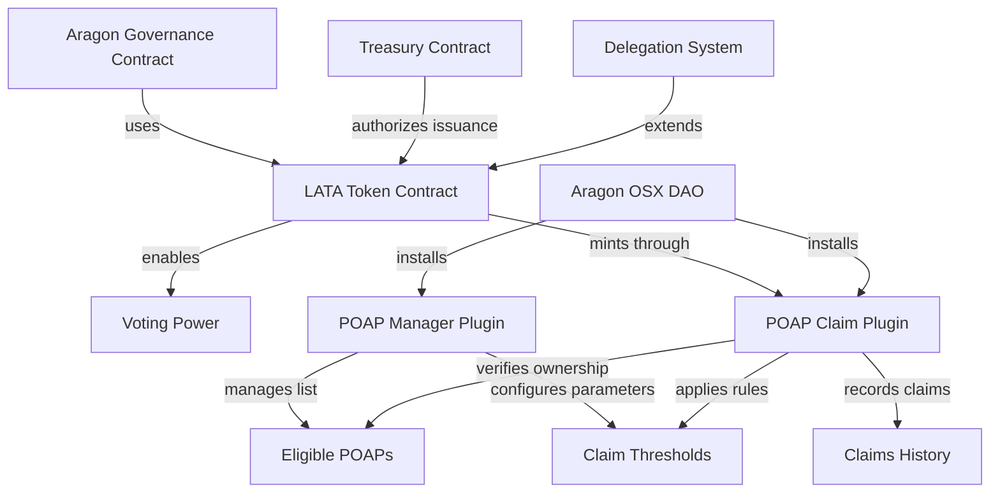
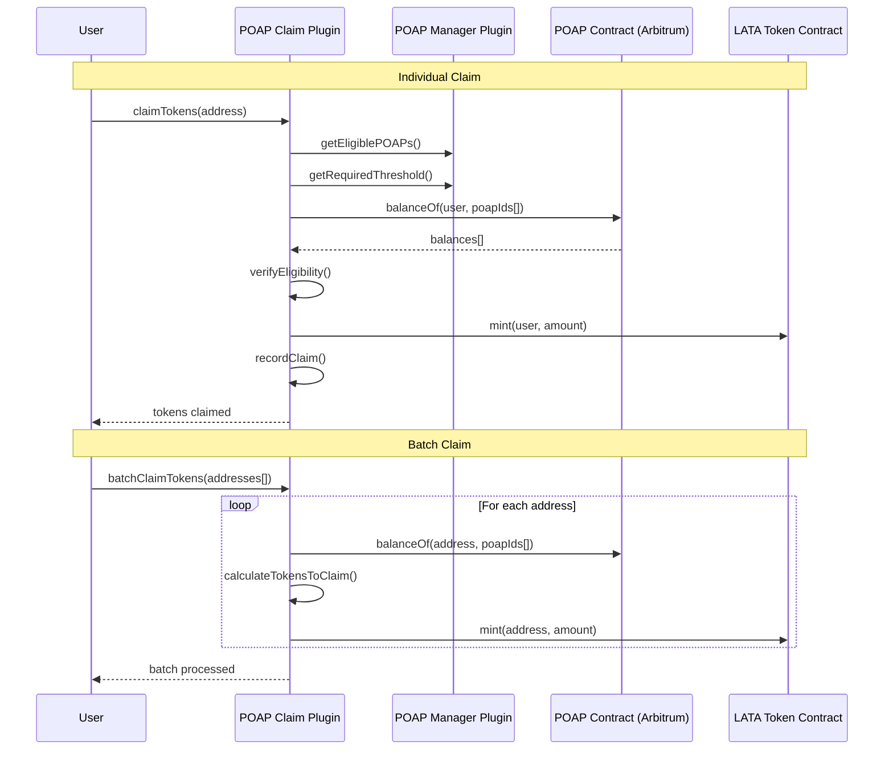
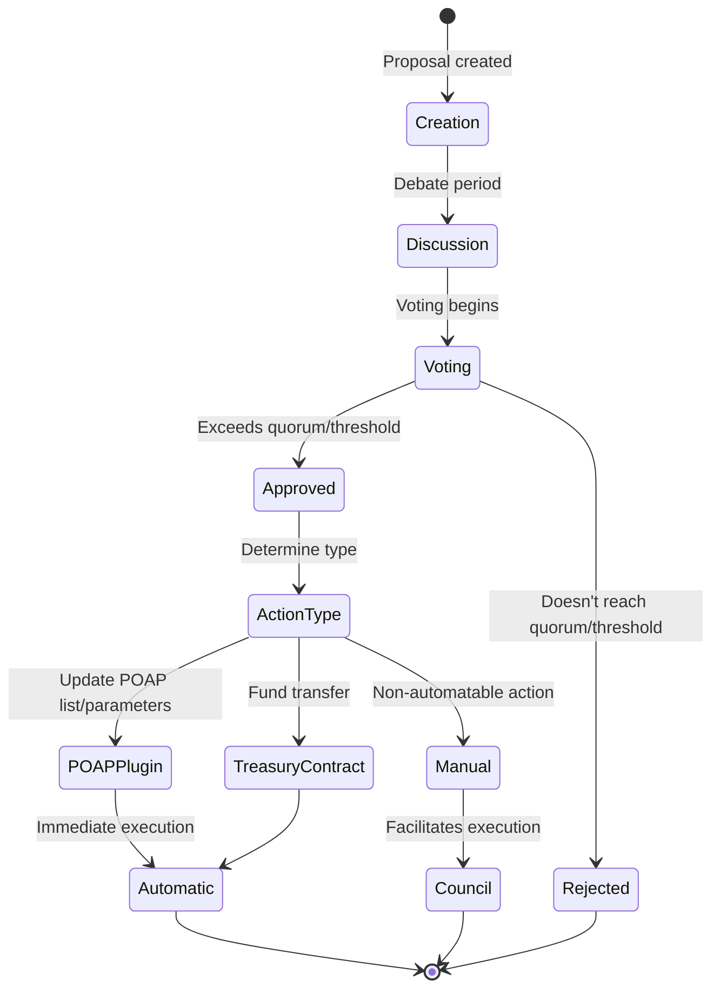
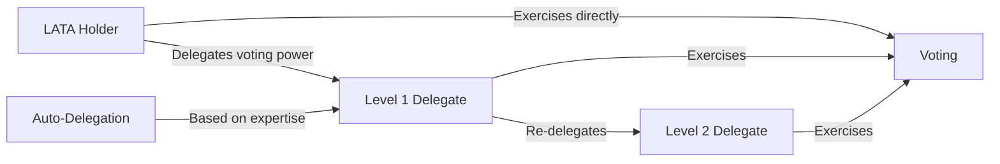
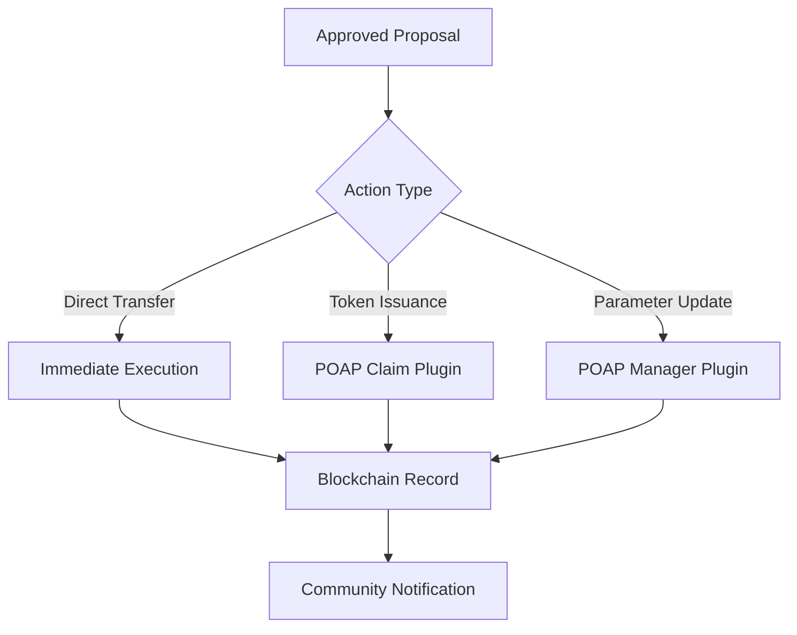

# EnceboDAO: Yellow Paper v2.0

## Abstract

This document details the technical, economic, and governance architecture of the EthEcuador community DAO, a decentralized autonomous organization designed to foster the growth of the web3 ecosystem in Ecuador. Through automated tokenized incentive mechanisms, decentralized voting systems, and transparent treasury management, EthEcuador DAO establishes a framework for community participation, collective decision-making, and the development of projects with local impact.

## 1. Introduction

EnceboDAO (Derived from "Encebollado", Ecuador's most famous soup) is an organization with an Ecuadorian touch, represented by rules coded in smart contracts, characterized by its transparency, censorship resistance, and decentralized governance. The DAO seeks to increase engagement and sense of belonging among community members through the use of web3 platforms, promoting transparency, decentralization, and inclusion in all its processes.

## 2. Fundamental Principles

EnceboDAO's architecture is based on the following principles:

1. **Decentralization**: Decision-making must be distributed among community members.
2. **Transparency**: All operations, transactions, and decisions must be verifiable on the blockchain.
3. **Meritocracy**: Contributions to the community are recognized and rewarded proportionally.
4. **Sustainability**: The economic structure must guarantee the long-term viability of the organization.
5. **Inclusivity**: Minimal barriers to entry for new community members.
6. **Automation**: Token distribution and incentive management processes are automated and verifiable.

## 3. Technical Architecture

### 3.1 Deployment Network

The deployment will be on **Arbitrum**, a layer 2 solution for Ethereum, selected for its advantages:

- Low transaction costs compared to Ethereum mainnet.
- High security inherited from Ethereum.
- Established ecosystem of DAO tools.
- Full compatibility with ERC-20 and ERC-721 standards.
- Fast confirmation times.
- Native support for POAPs on the Arbitrum network.

### 3.2 Management Platform

The DAO uses **Aragon OSX** as the primary platform for its creation and administration, leveraging its features:

- Modular architecture with custom plugins
- Intuitive interface for DAO creation and management
- Pre-configured modules for voting, finance, and memberships
- Wide compatibility with Arbitrum
- Integrated treasury management tools
- Extensible plugin system for specific functionalities

### 3.3 System Components

#### 3.3.1 Main Smart Contracts

1. **Token Contract (LATA)**: ERC-20Votes implementation of the governance token.
   - Controlled issuance functions by the POAP Claim Plugin.
   - Automated distribution mechanisms based on POAP verification.
   - Integrated vote delegation system (ERC-20Votes).
   - Interface for balance queries and voting rights.

2. **POAP Manager Plugin**: Aragon OSX plugin for parameter management.
   - Management of eligible POAPs list (updatable by governance).
   - Claim threshold configuration (initially 5 POAPs).
   - Access control based on Aragon permissions.
   - Interface for parameter administration.

3. **POAP Claim Plugin**: Aragon OSX plugin for claim automation.
   - Automatic verification of POAP ownership.
   - Individual claim by user.
   - Batch claim functionality (available for token holders).
   - Prevention of double claiming per POAP.
   - Transaction history recording.

4. **Governance Contract**: Proposal and voting system (Aragon OSX).
   - Proposal presentation and management.
   - Token-weighted voting with LATA.
   - Automatic execution of approved proposals.
   - Native integration with plugins.

5. **Treasury Contract**: Community fund management (Aragon OSX).
   - Multi-signature wallet of the governance council.
   - Implementation of issuance rules approved by governance.
   - Automatic fund control through proposals.

#### 3.3.2 POAP Automation Architecture

### 3.4 Governance Council

The EthEcuador DAO Governance Council is responsible for facilitating the execution of decisions approved by the community through the voting system in Aragon OSX.

This council has the capacity to:

- Execute technical decisions approved through voting that cannot be automated.
- Update the list of eligible POAPs through governance proposals.
- Modify system claim parameters (thresholds, limits) via governance.
- Perform technical updates when necessary.
- Respond to emergency situations.
- Represent the DAO in external relations.

## 4. Economic Model

### 4.1 Tokenomics

#### 4.1.1 Governance Token

- **Name and Symbol**: LATA
- **Description**: Inspired by the Ecuadorian colloquial expression referring to the "Sucre" currency.
- **Standard**: ERC-20Votes on Arbitrum.
- **Divisibility**: 18 decimals.
- **Initial Total Supply**: 0 LATA (automated progressive issuance)
- **Special Features**: Integrated vote delegation system and automated POAP-based claiming.

#### 4.1.2 Automated POAP-Based Distribution System

LATA issuance follows a fully automated model based on verification of specific POAP ownership:

**Automated Claim Mechanism**:

1. **Eligible POAPs List**:
   - Maintained and updated by the POAP Manager Plugin.
   - Controlled by decentralized governance.
   - Includes POAPs from events, community calls, and verified activities.

2. **Eligibility Threshold**:
   - **Initial**: Minimum 5 POAPs from the eligible list.
   - **Configurable**: Modifiable via governance proposals.
   - **Automatic Verification**: The system automatically verifies threshold compliance.

3. **Conversion Rate**:
   - **Base**: 1 LATA per eligible POAP owned.
   - **No initial upper limit**: Users can claim tokens for all their eligible POAPs.
   - **Double claim prevention**: Each POAP can only be used once for claiming.

4. **Claim Methods**:
   - **Individual**: Any user can claim their own tokens.
   - **Batch**: LATA token holders can process bulk claims for multiple addresses.
   - **Automatic Verification**: The system automatically verifies POAP ownership on Arbitrum.

#### 4.1.3 Additional Governance Issuance

In addition to the automated POAP system, the community can approve additional issuances through voting for:

- Rewarding exceptional contributions not covered by POAPs.
- Special growth campaigns.
- Specific project funding.
- Economic adjustments according to DAO evolution.

#### 4.1.4 Automated LATA Rewards Reference Table

| POAP Source | Reward per POAP |
|-------------|-----------------|
| In-Person Events | 1 LATA |
| Community Calls | 1 LATA |
| Workshops/Tutorials | 1 LATA |
| Verified Contributions | 1 LATA |
| Special Activities | 1 LATA |

**Claim Requirements**:
- Minimum 5 POAPs from eligible list
- Automatic ownership verification on Arbitrum
- No time limit for claiming (while POAPs remain eligible)

### 4.2 Sustainability Model

The DAO's financial sustainability is maintained through:

1. **Automated Incentive System**: Reduction of administrative costs.
2. **Direct Donations**: Voluntary contributions to the treasury.
3. **Project Percentage**: Revenue from community projects.
4. **Grants and External Funding**: Grants optimized by automation.

## 5. Governance System

### 5.1 Automated Decision Structure

#### 5.1.1 Proposal Types

1. **POAP Management Proposals**:
   - Add new POAPs to the eligible list.
   - Remove POAPs from the eligible list.
   - Modify minimum POAP threshold required.
   - Adjust POAP to LATA conversion rate.

2. **Project Development Proposals**: Community-funded projects.
3. **Parameter Change Proposals**: DAO configuration modifications.
4. **Integration Proposals**: Incorporation of new tools or protocols.
5. **Improvement Proposals**: Changes to processes or smart contracts.

#### 5.1.2 Voting Process

1. **Proposal Creation**: Any member with the minimum required tokens can create proposals.
2. **Discussion Period**: Time allocated for community debate.
3. **Active Voting**: Token holders cast weighted votes (1 token = 1 vote).
4. **Automatic Execution**: POAP management and treasury proposals execute automatically.
5. **Manual Facilitation**: Council facilitates execution of non-automatable proposals.

#### 5.1.3 Governance Parameters

- **Proposal Threshold**: 10 LATAs minimum to submit proposals (adjusted for automation).
- **Voting Duration**: 7 days for voting period.
- **Quorum**: 25% of circulating tokens participation required.
- **Approval Threshold**: 60% affirmative votes needed.
- **Grace Period**: 48 hours before automatic execution for review.

#### 5.1.4 Advanced Delegation System

The delegation system includes advanced functionalities:

- **Category Delegation**: Specific delegation by proposal type (POAPs, finance, technical).
- **Smart Auto-Delegation**: Automatic delegate suggestions based on participation history.
- **Temporal Delegation**: Delegation with automatic time limits.
- **Automatic Notifications**: Alerts when delegated votes are exercised.

### 5.2 Automated Treasury Management

The automated treasury system includes:

- **Automatic Execution**: Approved transfers execute without manual intervention.
- **Security Limits**: Maximum amounts for automatic execution.
- **Multi-Signature Review**: Larger transactions require Council approval.
- **Total Transparency**: All transactions recorded on blockchain.

### 5.3 Automated Meritocracy

The system automatically recognizes contributions through:

- **POAP History**: Consistent participation in events and activities.
- **Token Quantity**: Direct result of demonstrated commitment.
- **Delegation Patterns**: Community recognition as trusted expert.
- **Successful Proposals**: History of approved and executed proposals.

## 6. Implementation Status

### 6.1 Development Roadmap

**Phase 1: Plugin Development (4-6 weeks)**
- POAP Manager Plugin development
- POAP Claim Plugin development
- Unit and integration testing

**Phase 2: Testnet Deployment (2-3 weeks)**
- Deployment on Arbitrum Sepolia
- Test DAO creation on Aragon OSX
- Testing with test POAPs

**Phase 3: Validation and Audit (3-4 weeks)**
- Contract security audit
- Core team testing
- Adjustments based on feedback

**Phase 4: Mainnet Launch (2 weeks)**
- Deployment on Arbitrum mainnet
- Migration of existing POAPs
- Community socialization and adoption

### 6.2 Current Status

- **Technical Design**: Completed
- **Plugin Specifications**: In development
- **Base Contracts**: In planning
- **User Interface**: In design

## 7. Security Considerations

### 7.1 Mitigated Attack Vectors

- **Double Claiming**: Automatic prevention for already claimed POAPs.
- **Fake POAPs**: Verification against governance-curated list.
- **Spam Attacks**: Minimum POAP threshold required.
- **Parameter Manipulation**: Only modifiable via decentralized governance.

### 7.2 Security Mechanisms

- **Pause Functionality**: Ability to pause claims in emergencies.
- **Rate Limiting**: Limits on batch claims to prevent abuse.
- **Timelock**: Delay in execution of critical changes.
- **Multi-Signature**: Multi-sig backup for critical actions.

## 8. Conclusion

EnceboDAO v2.0 represents a significant evolution toward complete automation of incentives and decentralized governance. Through its automated POAP-based token claiming system and native integration with Aragon OSX, the DAO establishes a new standard for verifiable community participation and fair distribution of governance power.

The implementation of specialized plugins for POAP management not only reduces friction for users but also guarantees transparency, verifiability, and scalability of the incentive system, positioning EnceboDAO as a replicable model for other communities in the Latin American web3 ecosystem.
