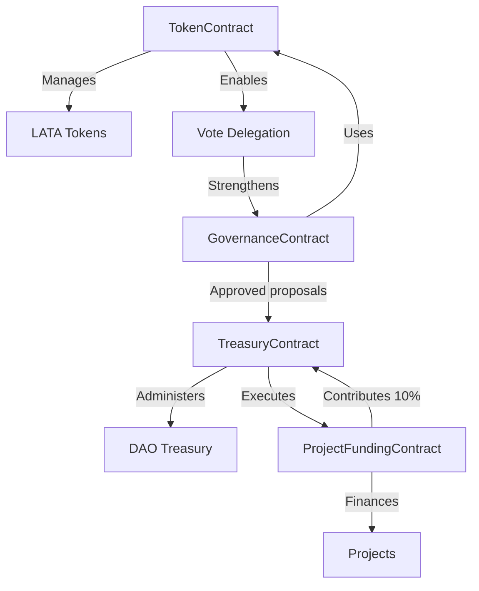
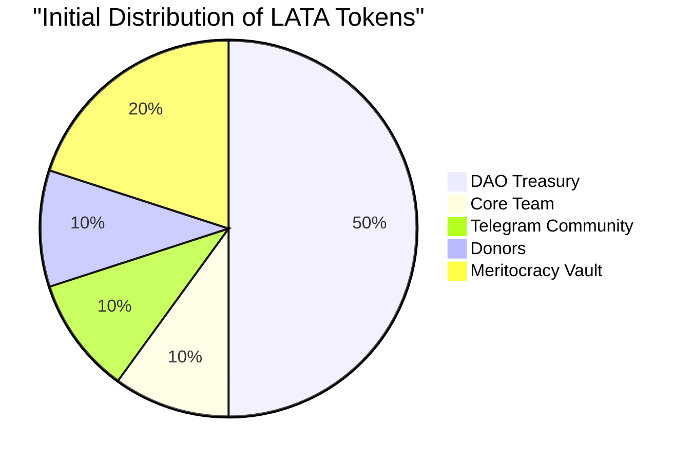
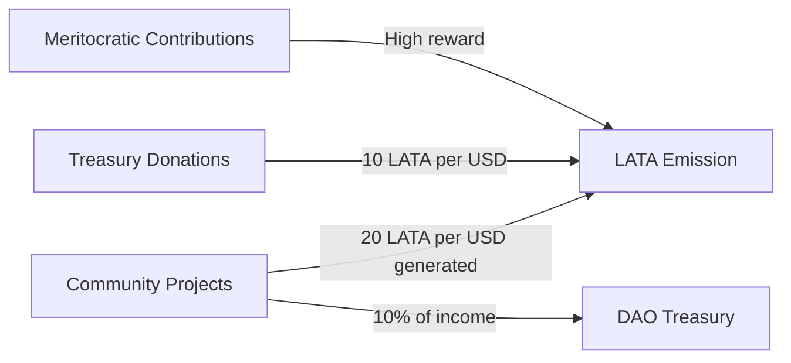
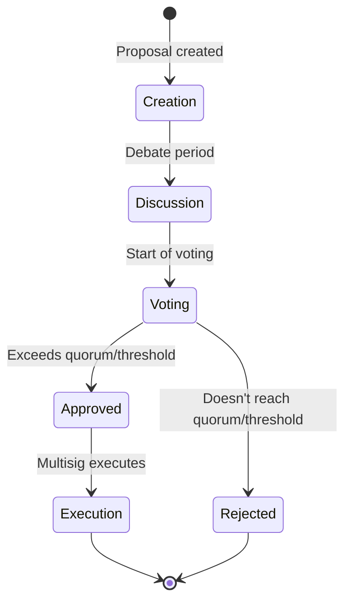
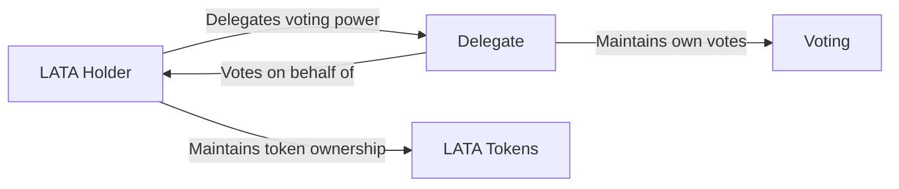
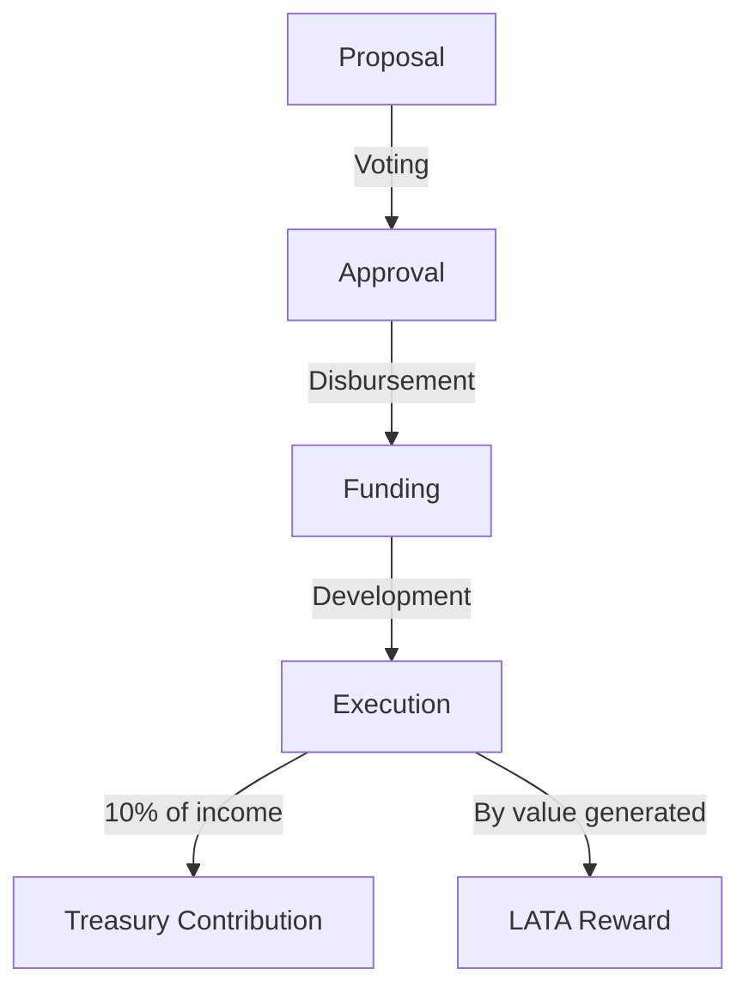
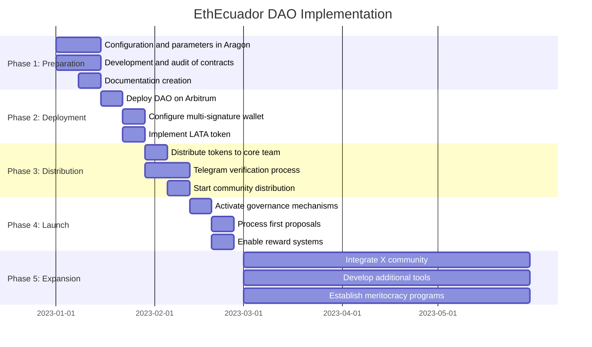

# EthEcuador DAO: Yellow Paper

## Abstract

This document details the technical, economic, and governance architecture of EthEcuador DAO, a decentralized autonomous organization designed to foster the growth of the web3 ecosystem in Ecuador. Through tokenized incentive mechanisms, decentralized voting systems, and transparent treasury management, EthEcuador DAO establishes a framework for community participation, collective decision-making, and the development of projects with local impact.

## 1. Introduction

EthEcuador DAO is an organization represented by rules encoded in smart contracts, characterized by its transparency, censorship resistance, and decentralized governance. The DAO seeks to increase community members' engagement and sense of belonging through the use of web3 platforms, promoting transparency, decentralization, and inclusion in all its processes.

## 2. Fundamental Principles

EthEcuador DAO's architecture is based on the following principles:

1. **Decentralization**: Decision-making must be distributed among community members.
2. **Transparency**: All operations, transactions, and decisions must be verifiable on the blockchain.
3. **Meritocracy**: Contributions to the community are recognized and rewarded proportionally.
4. **Sustainability**: The economic structure must guarantee the long-term viability of the organization.
5. **Inclusivity**: Minimal entry barriers for new community members.

## 3. Technical Architecture

### 3.1 Deployment Network

The DAO infrastructure will be implemented on **Arbitrum**, a Layer 2 solution for Ethereum, selected for its advantages:

- Low transaction costs compared to Ethereum mainnet
- High security inherited from Ethereum
- Established ecosystem of tools for DAOs
- Full compatibility with ERC-20 and ERC-721 standards
- Fast confirmation times

### 3.2 Management Platform

The DAO will use **Aragon** as the main platform for its creation and administration, leveraging its features:

- Intuitive interface for DAO creation and management
- Preconfigured modules for voting, finances, and memberships
- Wide compatibility with Arbitrum
- Integrated treasury management tools
- Extensibility through custom plugins

### 3.3 System Components

#### 3.3.1 Smart Contracts



The system will consist of the following interconnected smart contracts:

1. **TokenContract**: ERC-20 implementation of the LATA governance token.
   - Controlled emission functions
   - Automated distribution mechanisms
   - Interface for balance queries and voting rights

2. **GovernanceContract**: Proposal and voting system.
   - Submission and management of proposals
   - Token-weighted voting
   - Automatic execution of approved proposals

3. **TreasuryContract**: Community fund management.
   - Interface for multisig of authorized signers
   - Transparent record of income and expenses
   - Automation of distributions and contributions

4. **ProjectFundingContract**: Project funding and management.
   - Request for project funds
   - Payment distribution to executors
   - Automatic 10% contribution to treasury

### 3.4 Multi-signature Wallet

Treasury management and DAO administration will be carried out through a multi-signature wallet on Arbitrum, controlled by the most active members of the project. **The call for participation in this active DAO team, who will be the signatories of the multisig wallet, was conducted through the Telegram channel of the core team.** This wallet will have the ability to:

- Execute decisions approved by voting
- Manage treasury funds
- Perform technical updates when necessary
- Respond to emergency situations

## 4. Economic Model

### 4.1 Tokenomics

#### 4.1.1 Governance Token

- **Name and Symbol**: LATA
- **Description**: Inspired by the Ecuadorian colloquial expression for the "Sucre" currency
- **Standard**: ERC-20 with ERC-20Votes extension on Arbitrum
- **Divisibility**: 18 decimals
- **Initial Total Supply**: 10,000 LATA
- **Special Features**: Integrated vote delegation system

#### 4.1.2 Initial Distribution

The initial supply of 10,000 LATA will be distributed as follows:



1. **DAO Treasury**: 5,000 LATA (50%)
   - Managed through the multi-signature wallet
   - Intended to fund community projects and operations

2. **Core Team**: 1,000 LATA (10%)
   - 17 active members × 58.82 LATA each (rounded)
   - Includes founders and main contributors

3. **Telegram Community**: 1,000 LATA (10%)
   - 128 members × 7.81 LATA each (rounded)
   - Distribution per active member through verification process

4. **Donors**: 1,000 LATA (10%)
   - Reserved to reward initial economic donations
   - Distribution rate: 10 LATA per 1 USD donated

5. **Meritocracy Vault**: 2,000 LATA (20%)
   - Reserved to reward meritorious contributions
   - Higher reward rate than economic donations

#### 4.1.3 Expanded Distribution (post-launch)

To accommodate distribution to the X community (756 followers), a controlled additional emission will be contemplated:

- Establish a verified airdrop program
- Require interaction with the DAO to claim tokens
- Limit to 1 LATA per verified follower

#### 4.1.4 Continuous Generation



Post-launch token emission will occur through:

1. **Rewards for Meritocratic Contributions**:
   - Event organization: 100 LATA per small event (scalable according to impact)
   - Technical development: LATA proportional to effort and value generated
   - Community management: LATA for administrative and coordination tasks
   - *Higher valuation than rewards for economic donations*

2. **Treasury Donations**:
   - Base conversion rate: 10 LATA for each 1 USD donated
   - Mechanism implemented through smart contract

3. **Project Contributions**:
   - 20 LATA for each 1 USD generated by community projects
   - 10% of project income automatically allocated to treasury

### 4.2 Sustainability Model

The DAO's financial sustainability is based on:

1. **Direct Donations**: Voluntary contributions to the treasury
2. **Project Percentage**: 10% of the income from community projects
3. **Grants and External Funding**: Grants from foundations and blockchain ecosystems

## 5. Governance System

### 5.1 Decision Structure



#### 5.1.1 Types of Proposals

1. **Funding Proposals**: Request for funds for projects or initiatives
2. **Parameter Change Proposals**: Modifications to the DAO configuration
3. **Integration Proposals**: Incorporation of new tools or protocols
4. **Improvement Proposals**: Changes in processes or smart contracts

#### 5.1.2 Voting Process

1. **Proposal Creation**: Any member with the required minimum of tokens can create proposals
2. **Discussion Period**: Time allocated for community debate
3. **Active Voting**: Token holders cast weighted votes (1 token = 1 vote)
4. **Execution**: Implementation by the multisig of approved proposals that exceed the quorum threshold

#### 5.1.3 Governance Parameters

- **Proposal Threshold**: 10 LATA minimum to submit proposals
- **Voting Duration**: 5 days for voting period
- **Quorum**: 10% of participating tokens required
- **Approval Threshold**: 51% of affirmative votes needed

#### 5.1.4 Vote Delegation



EthEcuador DAO implements a vote delegation system that allows members to transfer their voting power to other participants without ceding ownership of their tokens. Main features:

- **Flexible Delegation**: Any LATA holder can delegate their voting power to another member
- **Revocation at Any Time**: Delegation can be revoked by the original holder whenever desired
- **Partial or Total Delegation**: Possibility to delegate only a portion of tokens
- **Transparency**: All delegations are recorded on the blockchain and are publicly verifiable
- **No Transfer of Ownership**: The delegator maintains full ownership of their tokens
- **Transitive Delegation**: A delegate can in turn delegate the received votes (configurable according to community preference)

### 5.2 Treasury Management

#### 5.2.1 Multi-signature Wallet

Treasury management will be carried out through the multi-signature wallet controlled by the most active members of the project. **These members were selected through an open call made on the Telegram channel of the core team, where their consistent participation and significant contributions to the project were evaluated.** The configuration will require the approval of a subset of signatories (e.g., 4 of 7) to execute transactions.

#### 5.2.2 Funding Flow

1. **Funds Reception**:
   - Direct donations
   - Project contributions (automatic 10%)
   - External grants

2. **Fund Disbursement**:
   - Approval through voting
   - Execution by multisig signers
   - Transparent record on the blockchain

### 5.3 Project Execution

#### 5.3.1 Project Lifecycle



1. **Proposal**: Detailed presentation with objectives, budget, and deliverables
2. **Voting**: Approval by the community through weighted voting
3. **Funding**: Fund disbursement according to predefined milestones
4. **Execution**: Project development with periodic updates
5. **Contribution**: Automatic 10% return to treasury
6. **Reward**: Token issuance proportional to contribution

#### 5.3.2 Meritocracy

Project allocation will prioritize members with a proven track record of:

- Active participation in the community
- Successful execution of previous projects
- Significant contributions to the ecosystem

Rewards for meritocratic contributions will be significantly higher than those granted for economic donations, incentivizing active participation over passive contributions.

## 6. Technical Implementation

### 6.1 Smart Contracts

#### 6.1.1 TokenContract

```solidity
// SPDX-License-Identifier: MIT
pragma solidity ^0.8.0;

import "@openzeppelin/contracts/token/ERC20/extensions/ERC20Votes.sol";
import "@openzeppelin/contracts/access/AccessControl.sol";

contract LataToken is ERC20Votes, AccessControl {
    bytes32 public constant MINTER_ROLE = keccak256("MINTER_ROLE");
    
    constructor() ERC20("Lata", "LATA") ERC20Permit("Lata") {
        _grantRole(DEFAULT_ADMIN_ROLE, msg.sender);
        _grantRole(MINTER_ROLE, msg.sender);
        
        // Initial supply of 10,000 LATA
        uint256 initialSupply = 10000 * 10**decimals();
        _mint(msg.sender, initialSupply);
    }
    
    function mint(address to, uint256 amount) public onlyRole(MINTER_ROLE) {
        _mint(to, amount);
    }
    
    // The following functions are overrides required by Solidity
    function _afterTokenTransfer(address from, address to, uint256 amount) internal override(ERC20Votes) {
        super._afterTokenTransfer(from, to, amount);
    }

    function _mint(address to, uint256 amount) internal override(ERC20Votes) {
        super._mint(to, amount);
    }

    function _burn(address account, uint256 amount) internal override(ERC20Votes) {
        super._burn(account, amount);
    }
}
```

#### 6.1.2 ProjectFundingContract

```solidity
// SPDX-License-Identifier: MIT
pragma solidity ^0.8.0;

import "@openzeppelin/contracts/access/Ownable.sol";
import "./LataToken.sol";

contract ProjectFunding is Ownable {
    LataToken public token;
    address public treasury;
    uint256 public treasuryFeePercentage = 10;
    
    // Reward rates
    uint256 public donationRewardRate = 10; // 10 LATA per 1 USD donated
    uint256 public projectContributionRate = 20; // 20 LATA per 1 USD from projects
    
    constructor(address _token, address _treasury) {
        token = LataToken(_token);
        treasury = _treasury;
    }
    
    function executePayment(address recipient, uint256 amount) public onlyOwner {
        uint256 treasuryAmount = (amount * treasuryFeePercentage) / 100;
        uint256 recipientAmount = amount - treasuryAmount;
        
        // Transfer funds to recipient
        (bool success1, ) = recipient.call{value: recipientAmount}("");
        require(success1, "Transfer to recipient failed");
        
        // Transfer fee to treasury
        (bool success2, ) = treasury.call{value: treasuryAmount}("");
        require(success2, "Transfer to treasury failed");
        
        // Mint tokens for the recipient based on contribution rate
        uint256 tokensToMint = amount * projectContributionRate; // 20 tokens per $1
        token.mint(recipient, tokensToMint);
    }
    
    function processDonation(address donor) public payable {
        require(msg.value > 0, "Donation amount must be greater than 0");
        
        // Transfer donation to treasury
        (bool success, ) = treasury.call{value: msg.value}("");
        require(success, "Transfer to treasury failed");
        
        // Calculate tokens to mint based on USD value
        // This assumes 1 ETH = X USD, would need oracle in production
        uint256 usdValue = calculateUsdValue(msg.value);
        uint256 tokensToMint = usdValue * donationRewardRate; // 10 tokens per $1
        
        // Mint tokens for donor
        token.mint(donor, tokensToMint);
    }
    
    function calculateUsdValue(uint256 ethAmount) internal pure returns (uint256) {
        // This is a placeholder - production would use Chainlink or similar oracle
        uint256 ethUsdPrice = 3000; // Example: 1 ETH = $3000 USD
        return (ethAmount * ethUsdPrice) / 1 ether;
    }
    
    receive() external payable {
        processDonation(msg.sender);
    }
}
```

### 6.2 Initial Distribution with Aragon

The technical implementation with Aragon on Arbitrum will follow these steps:

1. **DAO Creation**:
   - Deploy the DAO through the Aragon interface on Arbitrum
   - Configure voting parameters (threshold, duration, quorum)
   - Establish the multi-signature wallet as controller

2. **Token Configuration**:
   - Deploy the LATA token with initial supply of 10,000
   - Integrate with Aragon's token module
   - Configure mining permissions controlled by the DAO

3. **Initial Distribution**:
   - Allocate 5,000 LATA (50%) to the DAO treasury
   - Distribute 58.82 LATA to each of the 17 core team members
   - Reserve 1,000 LATA for the Telegram community (7.81 per member)
   - Reserve 1,000 LATA to reward donations
   - Reserve 2,000 LATA in the meritocracy vault

4. **Reward Automation**:
   - Implement contracts for donation rewards
   - Configure distribution system for the Telegram community
   - Establish meritocracy vault distribution mechanisms

### 6.3 Implementation Roadmap



1. **Phase 1: Preparation (Weeks 1-2)**
   - Finalize configuration and parameters in Aragon
   - Develop and audit smart contracts
   - Create technical documentation and user guides

2. **Phase 2: Deployment (Weeks 3-4)**
   - Deploy DAO on Arbitrum through Aragon
   - Configure multi-signature wallet with active members
   - Implement LATA token and distribution mechanisms

3. **Phase 3: Initial Distribution (Weeks 5-6)**
   - Distribute tokens to the core team
   - Establish verification process for Telegram members
   - Start community distribution process

4. **Phase 4: Launch (Weeks 7-8)**
   - Activate governance mechanisms
   - Process first proposals
   - Enable donation and meritocracy reward systems

5. **Phase 5: Expansion (Months 3-6)**
   - Implement system to integrate the X community
   - Develop additional tools according to community needs
   - Establish formal meritocracy and contribution programs

## 7. Expansion to Social Communities

### 7.1 Integration of the X Community

To integrate the 756 X followers, a stepped strategy will be implemented:

1. **Verification Process**:
   - Confirm that followers are genuine and active
   - Establish eligibility criteria (tenure, interaction, etc.)

2. **Controlled Distribution**:
   - Implement a verified claim system
   - Initial limit of 1 LATA per verified follower

3. **Participation Incentives**:
   - Additional rewards for completing onboarding tasks
   - Mechanisms to increase post-distribution participation

This integration will be carried out in a way that does not excessively dilute the voting power of the most active contributors, maintaining the balance between inclusion and meritocratic recognition.

## 8. Future Vision

### 8.1 DAO Evolution

EthEcuador DAO's structure is designed to evolve over time through:

1. **Community-Proposed Improvements**: Changes in parameters and processes
2. **Integration of New Technologies**: Adoption of advances in the DAO ecosystem
3. **Ecosystem Expansion**: Creation of sub-DAOs for specific initiatives

### 8.2 Long-term Objectives

1. **Web3 Education**: Train a new generation of developers and users
2. **Social Impact**: Implement blockchain solutions for local challenges
3. **Regional Relevance**: Position Ecuador as a reference in blockchain innovation
4. **Economic Sustainability**: Generate opportunities and resources for the community

## 9. Conclusion

EthEcuador DAO represents an innovative model of community organization based on blockchain technology, designed to encourage participation, recognize contributions, and manage resources in a transparent and decentralized manner. Through its tokenized governance system and automated funding mechanisms, the DAO establishes the foundations for sustainable growth of the web3 ecosystem in Ecuador.

The implementation on Arbitrum using Aragon, with the LATA token as a governance mechanism, provides a solid technical foundation with minimized operating costs. The balanced distribution model between treasury, core team, existing community, and reward mechanisms establishes aligned incentives for sustainable growth.

This Yellow Paper establishes the technical, economic, and governance parameters that will guide the development and implementation of EthEcuador DAO, subject to refinement through the community governance mechanisms described herein.

---

*This document represents the technical vision of EthEcuador DAO and is subject to modifications through community governance processes.*